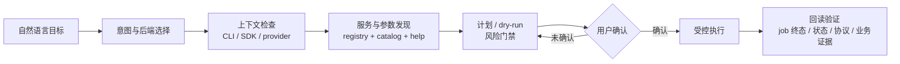
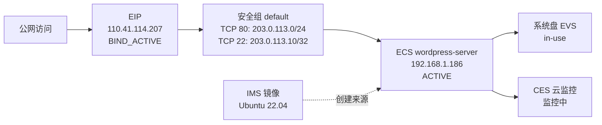

<h1 align="center">huaweicloud-skill</h1>

<p align="center"><b>上好云、用好云、管好云，一个大 Skill 一以贯之。</b></p>

<p align="center">
  
  
  
  
</p>

通用 Agent 直接操作云资源有三类典型事故：

- **猜错** —— 凭记忆猜 region、service、operation、参数和资源 ID，查询结果误导决策；
- **乱改** —— 没评估费用、网络暴露面和权限边界，就直接提交创建、绑定、删除；
- **误判完成** —— API 返回成功、job 提交成功就宣布"部署完成"，业务实际不可用。

`huaweicloud-skill` 把 Agent 从"凭记忆拼命令"升级为**"按证据、风险和后置验证推进任务"**：默认优先使用华为云 KooCLI（`hcloud`），需要类型化/程序化处理时可使用官方 SDK，用户明确要求 IaC 时进入 Terraform；查询默认只读，变更先计划、说明影响并取得确认，完成必须有证据。高频脚本减少重复工作，但不限制 Agent 处理长尾任务。

## 30 秒看效果

把这句话发给启用了本 Skill 的 Agent：

```text
使用 huaweicloud-skill，检查当前 hcloud 配置，然后盘点 cn-north-4 的
ECS、VPC、EIP 和安全组，输出资源摘要和发现的风险点。只读，不做任何变更。
```

Agent 会自动完成：检查 KooCLI/profile/region/project → 按本地 registry 和 catalog 发现服务与操作 → 构造 JSON 输出的只读查询 → 汇总资源、标注风险（如安全组对 `0.0.0.0/0` 开放的端口）→ 给出带命令和证据的报告。全程不需要你记任何 `hcloud` 语法。

## 为什么不一样

| 维度 | 裸 Agent | 使用 huaweicloud-skill |
| --- | --- | --- |
| API 发现 | 靠模型记忆猜 service/operation | 本地 catalog（199 服务 / 15,702 operation）+ registry + `--help` 实证 |
| 变更控制 | 可能直接提交创建/删除/绑定 | 计划 → dry-run → 风险门禁 → 显式确认 → 执行 → 回读 |
| 完成判断 | API 成功即宣布完成 | job 终态 → 资源状态 → SSH/协议/机内 → 业务证据，层层验收 |
| 错误处理 | 自然语言猜原因 | 结构化分桶：认证 / 权限 / region-project / 参数 / 配额 / 网络 |
| 凭据安全 | AK/SK 可能进对话和日志 | 脱敏封装，密钥只走环境变量/profile，禁止回显 |
| 高危端口 | 可能放行 `0.0.0.0/0` | SSH/常见 Web 端口入方向硬门禁 |
| 多轮任务 | 主要依赖当前对话 context | 复杂任务按 task 在 Agent workspace 中保留目标、约束、进展和下一步 |

一次典型任务的执行链路：



## 核心能力

- **hcloud 默认优先**：基于本机 `hcloud` 的真实 service、operation 和 help 工作；内置 catalog 覆盖 199 个公有云服务、15,702 个 operation，按服务懒加载，不炸上下文。
- **SDK 程序化后端**：支持官方 `huaweicloudsdk*` package 的类型化请求、复杂 body、分页/并发和结构化异常；curated 只读 runner 是便捷入口，不是全局白名单。
- **场景路由**：自然语言目标直接映射到本地 playbook、服务指南和 planner，覆盖建站、监控排障、成本优化、权限诊断、容器部署等高频场景。
- **变更门禁**：dry-run、风险识别、显式确认、执行记录、变更后验证一条链；安全、身份、密钥、治理类操作进入硬门禁。
- **验收闭环**：内置 HTTP/TCP/DNS/TLS 验收探测和证据判定，把"资源 ACTIVE"和"业务可用"严格区分开。
- **成本与治理**：账号盘点、闲置资源审计、回收前评审、账单语义纪律（事实 × 粒度 × 金额口径 × 账期，防止算错钱）。
- **Terraform 受控 IaC**：73 个本地示例 + provider 参考，fmt/init/validate/plan 全流程；import、drift、remote state 均有确认门禁，不自动 apply。
- **MaaS 模型能力**：华为云 MaaS 大模型对话、图像理解、图片生成/编辑、视频生成与用量治理，API Key 只走环境变量。
- **诚实分层**：curated / metadata-backed / evidence-gap 三层能力标注，配 300+ 离线测试和晋级审计——未实测的能力不会被包装成已验证。
- **跨服务任务记忆**：复杂、多轮或可中断任务优先复用宿主的持久 task state；有持久 workspace 时可保存最小任务文件。共享目标、事实来源和完成语义，但不要求特定平台机制。

## 快速开始

### 1. 准备 KooCLI

```bash
hcloud version
hcloud configure list
```

还没安装？参考 [KooCLI 快速安装](https://support.huaweicloud.com/qs-hcli/hcli_02_003.html)（更多见 [KooCLI 文档](https://support.huaweicloud.com/intl/zh-cn/cli/index.html)、[华为云支持中心](https://support.huaweicloud.com/intl/zh-cn/)）。`hcloud` 不可执行时，Agent 可以评估官方 SDK 或 Terraform 是否适合当前任务；没有任何可执行后端和实时证据时，只输出方案草稿和环境缺口。

### 2. 安装 Skill

```bash
# OpenClaw
openclaw skills install harryzhu123/huaweicloud-skill
```

也可以从市场页安装：[ClawHub](https://clawhub.ai/harryzhu123/huaweicloud-skill) ·
[OpenClaw 技能市场](https://github.com/OpenClawAgent/OpenClaw/blob/main/docs/skill-marketplace.md#available-skills)。
Codex CLI / Claude Code 用户可把本仓库放入本地 skills 目录，或在项目说明中引用 `SKILL.md`。

安装时只需要完整复制 `huaweicloud-skill` 目录。默认运行和自检不会查找它旁边的源码仓库或数据目录；本地 catalog、账单差距基线和最小覆盖率回归样例均随 Skill 发布。`hcloud`、按需安装的 SDK package、Terraform/obsutil 以及用户目录中的配置属于显式运行环境，不属于源码目录依赖。按任务检查和补齐依赖的方法见 [运行时依赖与准备](references/runtime-dependencies.md)。上游 SDK、Terraform Provider 或问题数据集只在维护时通过命令参数显式传入。

### 3. 用自然语言下达目标

```text
使用 huaweicloud-skill，通过 hcloud 检查当前 profile、region、project，
然后列出当前区域的 ECS、VPC、EIP 概览。只读查询，不做任何变更。
```

<details>
<summary><b>可选能力的额外准备（OBS / SDK / Terraform / MaaS）</b></summary>

- **OBS**：让 `hcloud obs ...` 或 `obsutil` 使用同一套可用 AK/SK；认证错误会保留在结构化输出里供继续诊断。
- **SDK**：无需 SDK 源码。按任务用 `pip install huaweicloudsdkecs` 等安装单个服务 package；可直接用于程序化任务，也可复用 curated 只读 runner。不要默认安装全量集合包。
- **Terraform**：需要本机 Terraform CLI 和可访问的华为云 provider（或本地 plugin cache）。真实 apply 必须基于用户确认过的 exact plan；`terraform apply -auto-approve` 不会被作为默认建议。
- **MaaS**：准备华为云 MaaS API Key，只通过环境变量传入：

  ```bash
  export MAAS_API_KEY=<your-maas-api-key>   # 兼容 MODELARTS_MAAS_API_KEY
  ```

  MaaS 是 API-first 能力面，不走 KooCLI service 路由；用量统计属治理查询，按本地 AK/SK 签名单独规划。

</details>

## 常用提示词

直接复制发给 Agent（这些是给 Agent 的自然语言目标，不是终端命令）：

**安全盘点账号资源**

```text
使用 huaweicloud-skill，先检查当前 hcloud 配置，再盘点 cn-north-4
的 ECS、VPC、Subnet、EIP 和安全组资源，输出资源摘要和发现的风险点。
```

**把报错变成诊断**

```text
使用 huaweicloud-skill 执行一次 ECS 列表查询。如果失败，请解释是认证、
区域、project_id、权限、参数还是输出格式问题，并给出下一步修复建议。
```

**创建 ECS 前先体检**

```text
我准备创建一台 ECS（镜像、规格、VPC、子网、安全组、密钥对、系统盘、数量）。
请用 huaweicloud-skill 先检查参数是否完整、安全、幂等，列出缺失项和风险；
不要直接创建。
```

**受保护的网络变更**

```text
使用 huaweicloud-skill 规划新增一条安全组规则。SSH 和常见 Web 端口不要使用
0.0.0.0/0，先做 dry-run 和风险识别，列出需要我确认的来源 CIDR；
在我明确确认前不要提交变更。
```

**闲置资源审计（只出候选，不出删除命令）**

```text
使用 huaweicloud-skill 先盘点当前账号，再识别可能闲置的 EIP、EVS、ECS、
ELB、RDS 候选。只输出候选、证据、风险和回收前检查顺序，不要生成删除命令。
```

**调用华为云 MaaS 大模型**

```text
使用 huaweicloud-skill 调用华为云 MaaS 大模型。先列出可选文本模型和
dry-run payload；确认后使用 MAAS_API_KEY 调用 V2 Chat 接口，不要记录密钥。
```

<details>
<summary><b>更多提示词：变更验证、可观测、账单、Terraform、图片/视频生成、闭环规划、拓扑图……</b></summary>

**变更后验证资源状态**

```text
使用 huaweicloud-skill 检查刚才的 EIP 绑定是否真正生效。请查询目标 ECS
和 EIP 的当前状态，说明公网 IP、绑定关系和仍需处理的问题。
```

**检查可观测性和日志证据**

```text
使用 huaweicloud-skill 检查这台 ECS 是否具备可观测证据。先查资源状态，
再通过 CES 发现指标 namespace、metric 和 dimension；如需要日志，只生成
LTS log group、stream 和有限时间窗口的只读查询计划。
```

**快速确认 OBS 配置**

```text
使用 huaweicloud-skill 检查 OBS 是否配置正确。如果 list bucket 失败，
请说明是 AK/SK、endpoint、权限还是账号侧问题。
```

**规划账单或成本查询**

```text
使用 huaweicloud-skill 为 2026-05 的月度账单汇总生成华为云 Billing/Cost
查询计划。区分事实类型、粒度和金额口径，结果脱敏；不从资源清单推断费用。
```

**用 Terraform 生成可重复 IaC**

```text
使用 huaweicloud-skill，先检查 hcloud 和 Terraform 本地环境，然后为一套 ECS +
EIP + 安全组的测试环境选择合适的 Terraform 示例和 reference。先输出 plan 前
需要确认的变量、依赖和风险，不要直接 apply。
```

**生成或理解图片（MaaS）**

```text
使用 huaweicloud-skill 走华为云 MaaS：先用 qwen2.5-vl-72b 做图片理解，
再用 qwen-image 生成一张站点配图。先 dry-run，输出本地文件和 manifest；
不要把 API Key 写进文件。
```

**创建视频生成任务（MaaS）**

```text
使用 huaweicloud-skill 通过华为云 MaaS 创建一个文生视频任务。先 dry-run 展示
payload；确认后提交任务，并轮询 task_id 直到 succeeded 或 failed，不要把
task_id 当成最终视频结果。
```

**核心服务闭环计划（planner-only）**

```text
使用 huaweicloud-skill 为核心服务生成一次上云/用云/管云闭环计划，
包括 VPC/安全组、EIP、EVS、ELB、RDS、OBS、DNS、SCM、CDN、CES/LTS。
按上下文发现、参数检查、风险门禁、受控执行、后置验证和治理审计输出；
只做规划，不执行真实云变更。
```

**治理闭环计划（planner-only）**

```text
使用 huaweicloud-skill 为治理服务生成一次管云闭环计划，覆盖 TMS、CTS、CBR、
RMS/Config、Billing/BSS、WAF、DLI、CodeArtsRepo。输出治理范围、只读证据、
风险和隐私门禁、review plan 和晋级缺口；不要修改任何治理配置，也不要
请求或暴露真实账单数据。
```

**场景闭环计划（planner-only）**

```text
使用 huaweicloud-skill 为场景服务生成一次闭环计划，覆盖 CCE、NAT、DCS、
RFS、UCS、IAM/KPS/IMS、安全姿态和数据库族。输出场景范围、只读 evidence
command plan、风险边界和晋级缺口；不要生成写操作，也不要宣称已完整闭环。
```

**先做场景路由**

```text
使用 huaweicloud-skill 先判断"我要上云部署一个 Web 服务，包含 ECS、VPC、
ELB、监控和后续成本治理"应该读哪些 playbook、指南和 planner。只做路由，
不要执行真实云查询或变更。
```

**用拓扑图沟通方案或结果**

```text
使用 huaweicloud-skill 先画一个 Mermaid 资源拓扑图，帮我确认公网访问、
EIP、安全组、ECS、EVS、IMS 和监控之间的关系。计划态和已查询到的事实要分开标注。
```

示例输出形态：



</details>

## 安全承诺

这些边界写在 Skill 的运行规则里，不依赖模型自觉：

| 风险点 | 默认处理 |
| --- | --- |
| 凭据（AK/SK、API Key、私钥） | 不在对话、日志、生成文件中回显或保存；只走本地环境变量 / profile |
| 安全组入口 | SSH/常见 Web 端口不得自动开放到 `0.0.0.0/0`；复用已有安全组也要读回规则证据 |
| 异步任务 | 跟到 job 终态，再做资源状态、协议或业务验收；`job_id`、`ACTIVE`、`task_id` 都不等于完成 |
| 高危变更 | 删除、回收、账单、审计、备份、安全策略默认只读或 planner-only；候选清单不等于执行授权 |
| Terraform 状态 | import / state / remote state 是高影响操作，必须显式确认；不自动 apply/destroy |
| 结果汇报 | 只描述真实发生的命令、输出和验证；计划态和已执行严格分开，不编造执行过程 |

## 能力边界（诚实版）

- ECS 的指导最完整：创建前校验、dry-run、job 终态、ACTIVE 回读、SSH 和应用验收全链路。
- 核心高频服务（VPC/安全组、EIP、EVS、ELB、RDS、OBS、DNS、SCM、CDN、CES/LTS）有生命周期闭环计划和验收判定；治理和场景类服务目前以只读规划为主，**不宣称完整执行闭环**。
- 长尾安全、数据库、身份类服务多为 metadata-backed 发现 + 证据缺口标注；默认不执行 mutation。
- 内置验收探测支持 HTTP/TCP/DNS/TLS；其他证据需要人工或专用工具采集后再判定。
- 覆盖规模以 `python3 scripts/hcloud_catalog_audit.py --pretty` 的输出为准。

## 需要你提供什么

- 可执行的 `hcloud` 和至少一个可用 profile（AK/SK 或其他认证方式）。
- 默认 region（如 `cn-north-4`）；项目级服务备好 project id。
- 变更类请求：目标资源 ID、期望状态、可接受的回滚方式。
- 缺什么 Agent 会追问；配置有问题时会给出结构化的失败原因（认证 / 权限 / region-project / 参数 / 输出格式）。

## 开发者文档

架构、脚本契约、服务覆盖策略和本地验证方法：

- [`docs/technical-overview.md`](docs/technical-overview.md) — 技术总览
- [`docs/unified-task-mechanism-implementation.md`](docs/unified-task-mechanism-implementation.md) — v0.9.1 轻量大一统机制实施说明
- [`docs/architecture.md`](docs/architecture.md) — 架构设计
- [`docs/implementation-details.md`](docs/implementation-details.md) — 实现细节
- [`docs/data-and-coverage.md`](docs/data-and-coverage.md) — 数据与覆盖
- [`docs/cloud-lifecycle-scenarios.md`](docs/cloud-lifecycle-scenarios.md) — 上云/用云/管云场景拆解

## License

MIT License. See [LICENSE](LICENSE).
