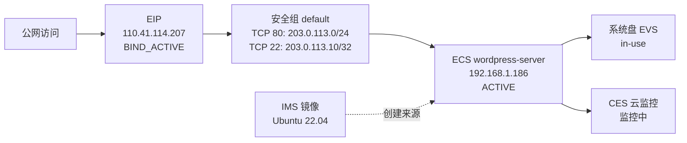

# huaweicloud-skill

`huaweicloud-skill` 是一个面向华为云 KooCLI / `hcloud` 的 Agent Skill。它让通用 Agent 能够用更安全、可审计、可复现的方式发现华为云 API、查询资源、诊断配置问题，并在需要时规划受保护的变更流程。

你不需要记住复杂的 `hcloud` 命令，也不需要直接调用仓库里的脚本。用户只用自然语言告诉 Agent 目标，Agent 负责选择 Skill 内部的工具、构造命令、检查风险和整理结果。

## 核心理念：帮助租户上好云、用好云、管好云

这个 Skill 的目标不是简单把云 API 暴露给 Agent，而是帮助租户把云资源生命周期走稳：

- **上好云**：在创建或变更前先确认账号、region、project、VPC、子网、安全组、镜像、规格、密钥和依赖拓扑，优先走 plan、dry-run、风险识别和显式确认，避免一开始就把资源建错、暴露错或配错。
- **用好云**：资源创建或调整后继续做 job、资源状态、SSH/应用、ELB 后端、EVS 文件系统、CES 指标、LTS 日志等验收，避免“API 返回成功”被误判成“业务已经可用”。
- **管好云**：通过账号盘点、闲置候选审计、回收前检查、标签治理、备份姿态、审计 trace、资源合规、账单/成本 request spec 和 run journal，把长期运营中的成本、安全、可观测和可追溯问题纳入治理。

更详细的场景对比和 ECS/典型服务拆解见 [docs/cloud-lifecycle-scenarios.md](docs/cloud-lifecycle-scenarios.md)。

它适合这些场景：

- 你希望 Agent 直接基于 `hcloud` 操作华为云，而不是靠记忆猜 API。
- 你需要先盘点账号、区域、项目和资源，再决定下一步动作。
- 你需要识别闲置、备份、标签、审计、日志、监控等治理前置问题。
- 你希望变更前有 dry-run、风险识别、确认门禁和变更后验证。
- 你希望把认证、区域、项目、参数、输出格式等 CLI 问题转成 Agent 能理解的结构化错误。

## 它怎么工作

一次典型任务会按这个顺序执行：

1. Agent 先检查本机 KooCLI、profile、region、project 和认证状态。
2. Agent 先用 curated service registry 和 playbook 判断是否有深度支持路径。
3. 如果服务不在 registry 中，再使用 skill 自带的 generated hcloud catalog 做 metadata-backed 发现、显式只读查询或 planner-only 变更计划。
4. 查询类任务直接走只读路径；变更类任务先做计划、dry-run 和风险识别。
5. 只有用户明确确认后，Agent 才会执行真实变更，并继续做结果验证。

## 快速开始

### 1. 准备 KooCLI

先确认本机可以运行 `hcloud`：

```bash
hcloud version
hcloud configure list
```

如果还没有安装或配置 KooCLI，请参考华为云官方文档：

- [KooCLI 快速安装](https://support.huaweicloud.com/qs-hcli/hcli_02_003.html)
- [KooCLI 国际站文档](https://support.huaweicloud.com/intl/zh-cn/cli/index.html)
- [华为云支持中心](https://support.huaweicloud.com/intl/zh-cn/)

如果 `hcloud_context_inspect.py` 返回 `hcloud.found=false`，Agent 应先提示用户完成 KooCLI 安装和 PATH 配置；在 `hcloud` 可执行前，不应继续执行真实云查询或变更。

如果要使用 OBS 能力，还需要让 `hcloud obs ...` 或 `obsutil` 使用同一套可用的 AK/SK。OBS 的认证错误会被保留在结构化输出里，便于 Agent 继续诊断。

### 2. 安装 Skill

安装后，在支持本地 Skill 的 Agent 中启用 `huaweicloud-skill`。例如 OpenClaw：

- [ClawHub: huaweicloud](https://clawhub.ai/zfish-lu/huaweicloud)
- [OpenClaw 技能市场：huaweicloud-skill](https://github.com/OpenClawAgent/OpenClaw/blob/main/docs/skill-marketplace.md#available-skills)

### 3. 让 Agent 使用它

可以直接用自然语言说明目标，Agent 会按 Skill 的规则先检查上下文、发现服务和操作、构造命令，再决定是否执行：

```text
使用 huaweicloud-skill，通过 hcloud 检查当前 profile、region、project，
然后列出当前区域的 ECS、VPC、EIP 概览。只读查询，不做任何变更。
```

## 使用样例

下面的样例都是给 Agent 的自然语言提示词，不是需要用户手动执行的终端命令。

#### 安全盘点当前账号资源

```text
使用 huaweicloud-skill，先检查当前 hcloud 配置，再盘点 cn-north-4
的 ECS、VPC、Subnet、EIP 和安全组资源，输出资源摘要和发现的风险点。
```

#### 把 hcloud 报错转成可诊断结果

```text
使用 huaweicloud-skill 执行一次 ECS 列表查询。如果失败，请解释是认证、
区域、project_id、权限、参数还是输出格式问题，并给出下一步修复建议。
```

#### 创建 ECS 前先检查参数

```text
我准备创建一台 ECS，配置包括镜像、规格、VPC、子网、安全组、密钥对、
系统盘和实例数量。请使用 huaweicloud-skill 先检查这些参数是否完整、
安全、幂等；如果还缺信息，请列出来。不要直接创建云服务器。

如果我后面粘贴创建参数 JSON，也请先做同样的检查，只输出缺失字段、
风险点和推荐修复方式。
```

#### 规划一次受保护的网络变更

```text
使用 huaweicloud-skill 规划新增一条安全组规则。SSH 和常见 Web 端口不要使用
0.0.0.0/0，请先做 dry-run 和风险识别，列出需要我确认的来源 CIDR；
在我明确确认前不要提交变更。
```

#### 规划典型服务的闭环任务

```text
使用 huaweicloud-skill 为 P0 核心服务生成一次上云/用云/管云闭环计划，
包括 VPC/安全组、EIP、EVS、ELB、RDS、OBS、DNS、SCM、CDN、CES/LTS。
请按上下文发现、参数检查、风险门禁、受控执行、后置验证和治理审计输出；
只做 planner，不执行真实云变更。
```

#### 规划管云治理闭环

```text
使用 huaweicloud-skill 为 P1 治理服务生成一次管云闭环计划，
覆盖 TMS、CTS、CBR、RMS/Config、Billing/BSS、WAF、DLI、CodeArtsRepo。
请输出治理范围、只读证据、风险和隐私门禁、review plan、晋级缺口；
不要写标签、改审计、改备份策略、改安全策略，也不要请求或暴露真实账单数据。
```

#### 规划 P2 场景闭环

```text
使用 huaweicloud-skill 为 P2 场景服务生成一次闭环计划，
覆盖 CCE、NAT、DCS、RFS、UCS、IAM/KPS/IMS、安全姿态和数据库族。
请输出场景范围、只读 evidence command plan、风险边界和下一步晋级缺口；
安全服务和数据库族只标注 evidence gap，不要生成写操作或宣称已经完整闭环。
```

#### 快速确认 OBS 配置

```text
使用 huaweicloud-skill 检查 OBS 是否配置正确。如果 list bucket 失败，
请说明是 AK/SK、endpoint、权限还是账号侧问题。
```

#### 变更后验证资源状态

```text
使用 huaweicloud-skill 检查刚才的 EIP 绑定是否真正生效。请查询目标 ECS
和 EIP 的当前状态，说明公网 IP、绑定关系和仍需处理的问题。
```

#### 审计闲置资源和回收前检查

```text
使用 huaweicloud-skill 先做当前账号资源盘点，然后基于已保存的 JSON 查询结果
识别可能闲置的 EIP、EVS、ECS、ELB、RDS、NAT 和安全组候选。只输出候选、
证据、风险和回收前检查顺序，不要生成删除、释放或退订命令。
```

#### 检查可观测性和日志证据

```text
使用 huaweicloud-skill 检查这台 ECS 是否具备可观测证据。先查资源状态，
再通过 CES 发现指标 namespace、metric 和 dimension；如需要日志，只生成
LTS log group、stream 和有限时间窗口的只读查询计划。
```

#### 规划账单或成本查询

```text
使用 huaweicloud-skill 为 2026-05 的月度账单汇总生成华为云 Billing/Cost
API request spec。只做请求规划，不签名、不发送请求、不从资源清单推断费用。
```

#### 用拓扑图沟通方案或结果

```text
使用 huaweicloud-skill 先画一个 Mermaid 资源拓扑图，帮我确认公网访问、
EIP、安全组、ECS、EVS、IMS 和监控之间的关系。计划态和已查询到的事实要分开标注。
```

示例输出形态：



## 能力亮点

- **CLI-first**：优先基于本机 `hcloud` 的真实 service、operation 和 help 信息工作，减少凭空猜测。
- **结构化上下文**：自动整理 profile、region、project、认证模式、CLI 路径、版本和常见配置问题。
- **多服务发现**：通过 registry、playbook 和 discovery 工具深度覆盖 ECS、VPC、EIP、EVS、IMS、KPS、RDS、ELB、OBS、CDN、IAM 等常用服务。
- **metadata-backed 广覆盖**：内置 hcloud metadata catalog；v0.3.1 起按 operation 粒度合并英文 metadata，并用中文 metadata 补齐缺失服务、operation 和 detail。当前 audit 覆盖 198 个本地 metadata 服务、15,666 个 hcloud operation；本机 `hcloud --help` 在去掉 HCS/ManageOne 相关服务后可见 199 个服务。运行时默认通过 `references/hcloud-service-catalog.index.json` 按服务懒加载，旧 full catalog `references/hcloud-service-catalog.generated.json` 保留用于兼容和完整 diff。准确覆盖规模以 `python3 scripts/hcloud_catalog_audit.py --pretty` 的 `catalog` / `metadata_backed` 输出和 `references/hcloud-service-catalog.fingerprint.json` 的 `source` 字段为准。registry 外服务默认只开放安全发现、显式参数只读查询和 planner-only 变更计划。
- **可信度分层**：metadata-backed 服务默认标为 catalog-derived；只读 smoke、dry-run 支持性和后续 confidence 信息单独记录，不把未实测能力包装成 curated coverage。
- **curated 维护门禁**：`references/service-curation-profiles.json` 记录 curated 服务和晋级候选的 readiness、resource query、playbook 和 risk profile；`hcloud_curated_promotion_audit.py` 用于阻止证据不足的服务提前进入 registry。
- **生命周期治理**：账号盘点、闲置资源审计、teardown review、CES/LTS 可观测、Billing/Cost request spec 和 CTS/TMS/CBR/RMS/Config/LTS candidate profiles 帮助用户从“能上云”继续走到“用好云、管好云”。
- **典型服务闭环**：`v0.3.2` 增加 P0 核心服务的六阶段 lifecycle closure planner，覆盖 VPC/安全组、EIP、EVS、ELB、RDS、OBS、DNS、SCM、CDN、CES/LTS，把依赖发现、参数检查、风险门禁、后置验证和治理审计放到同一个结构化计划里。
- **治理闭环计划**：P1 增加 `hcloud_governance_closure_plan.py`，把 TMS、CTS、CBR、RMS/Config、Billing/BSS、WAF、DLI、CodeArtsRepo 组织成只读/planner-only 治理计划，输出 evidence command plan、隐私边界、review plan、治理汇总和 curated 晋级缺口；Billing/BSS 只生成 request spec，不生成 live query 命令。
- **P2 场景闭环计划**：`v0.3.3` 增加 `hcloud_p2_scenario_closure_plan.py`，把 CCE、NAT、DCS、RFS、UCS、IAM/KPS/IMS、安全姿态和数据库族组织成场景级只读/planner-only 计划，输出 evidence command plan、metadata evidence gap、风险边界和下一步晋级建议。
- **安全执行封装**：统一处理超时、敏感信息脱敏、JSON 解析、错误分类和输出裁剪。
- **变更门禁**：变更类流程默认包含 dry-run、风险识别、显式确认、执行记录和变更后验证；metadata-backed 服务会根据 catalog category 抬高风险，安全合规、身份、密钥和治理类 mutation 会进入硬门禁。
- **入口暴露限制**：SSH `22` 和常见 Web 端口 `80`、`443`、`3000`、`5000`、`8000`、`8080` 的入方向规则会阻止 `0.0.0.0/0`。
- **拓扑图沟通**：必要时用 Mermaid 资源拓扑图展示需求、方案、结果或排障链路，并区分计划态和已验证事实。
- **开发者友好**：架构、扩展方式、服务覆盖策略和脚本契约都沉淀在 `docs/` 中，便于继续贡献。

## 你需要告诉 Agent 什么

为了让 Agent 能可靠完成云资源查询或变更，建议尽量提供这些信息。缺失的信息 Agent 会继续追问：

- `hcloud` 已安装，并且在当前终端可执行。
- 至少配置一个可用 profile，包含 AK/SK 或其他认证方式。
- 明确默认 region，例如 `cn-north-4`、`cn-east-3`。
- 对项目级服务准备 project id；可以通过 IAM、控制台或 `hcloud` 查询。
- 对账号级或全局服务确认是否需要特殊 endpoint 或 global project。
- OBS 查询需要额外确认 OBS 认证和 endpoint 是否可用。
- 变更类请求需要提供目标资源 id、期望状态和可接受的回滚方式。

你可以用自然语言给出这些信息，也可以在对话里粘贴配置片段、资源 ID、错误日志或创建参数 JSON。

如果配置有问题，Skill 会尽量把失败原因结构化，例如：

- 认证失败：AK/SK 不存在、签名失败、token 过期。
- 权限不足：IAM policy、项目权限、OBS bucket policy。
- 区域或 project 错误：region 不存在、project id 与 region 不匹配。
- 参数错误：缺少必填字段、字段名不符合当前 operation。
- 输出问题：命令成功但不是合法 JSON，或 stdout 被额外文本污染。

## 在常用 Agent 中使用

### OpenClaw

```bash
openclaw skills search huaweicloud
openclaw skills install zfish-lu/huaweicloud
openclaw skills list --eligible
```

在 OpenClaw 中提出这类请求即可触发：

```text
用 hcloud 帮我查一下 cn-north-4 当前有哪些 ECS 和 VPC。
```

```text
先规划一次给某台 ECS 绑定 EIP 的操作，只输出命令、风险点和验证方式，不要直接执行。
```

### Codex CLI / Codex App

把本仓库作为本地 Skill 安装或链接后，可以直接在对话里要求 Codex 使用 `huaweicloud-skill`：

```text
使用 huaweicloud-skill 检查当前华为云账号上下文，然后只读盘点 ECS、VPC 和 EIP。
```

```text
使用 huaweicloud-skill 规划一次 RDS 配置变更。先输出风险、影响面和需要我确认的参数，不要直接执行。
```

### Claude Code

可以把本仓库放入 Claude Code 的 skills 目录，或在项目说明中引用 `SKILL.md`。推荐提示：

```text
请使用 huaweicloud-skill。所有华为云查询都走 hcloud / KooCLI 路线，
变更前必须先 dry-run，并等待我确认。
```

## 开发者文档

README 面向普通用户快速上手。架构设计、内部脚本、服务覆盖策略和本地验证方法放在开发者文档中：

- [`docs/technical-overview.md`](docs/technical-overview.md)
- [`docs/architecture.md`](docs/architecture.md)
- [`docs/implementation-details.md`](docs/implementation-details.md)
- [`docs/data-and-coverage.md`](docs/data-and-coverage.md)

## License

MIT License. See [LICENSE](LICENSE).
