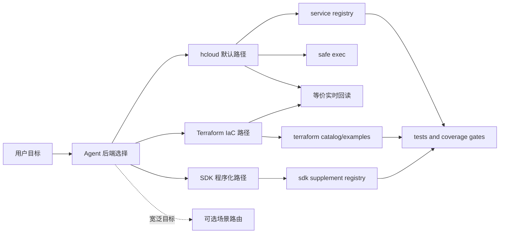

# huaweicloud-skill Developer Documentation

本目录是 `huaweicloud-skill` 的开发者文档，解释这个 skill 的架构、设计取舍、关键实现和数据资产。这里的文档面向维护者和二次开发者，不作为 agent 的运行时指令入口。

运行时入口仍然是：

- `SKILL.md`
- `references/backend-selection.md`
- `references/workflow.md`
- `references/service-registry.json`
- `scripts/`

## 设计框架速览

`huaweicloud-skill` 默认优先 hcloud，同时支持 SDK 程序化任务和 Terraform IaC。三者不是等权随机
选择：默认顺序是 `hcloud > SDK > Terraform`，SDK 可在类型化/复杂处理或 hcloud 实际障碍时承担
任务，Terraform 只由 IaC、import、drift 和长期纳管意图触发。高频脚本是可选捷径，不是新后端。



开发者看这个项目时，可以先把它理解成七个模块：

| 模块 | 代表文件 | 作用 |
| --- | --- | --- |
| 运行时入口 | `SKILL.md`、`references/workflow.md` | 告诉 agent 什么时候触发、按什么顺序工作。 |
| 跨服务共享与任务记忆 | `references/unified-principles.md`、`references/task-workspace-guide.md`、`references/goal-capability-guide.md`、`references/interaction-guidance.md`、`references/source-map.md`、`templates/` | 统一跨服务语义、目标组织、用户投影和知识所有权；优先复用宿主持久 task state，有 workspace 时可保存最小任务文件。 |
| 后端选择 | `references/backend-selection.md` | 约束 hcloud 默认优先、SDK 程序化路径、Terraform IaC 意图和后端切换证据。 |
| 场景路由 | `hcloud_scenario_router.py`、`references/scenario-router.json` | 把自然语言目标映射到 playbook、planner、SDK 补充点和 Terraform 候选。 |
| hcloud 执行框架 | `service-registry.json`、`hcloud_safe_exec.py`、查询/变更/验证脚本 | 负责发现、计划、执行、脱敏、错误诊断和后置验证。 |
| SDK 程序化路径 | `sdk-supplement-registry.json`、`hcloud_sdk_catalog.py`、`hcloud_sdk_readonly.py` | 支持官方 SDK 任务；registry 只约束便捷只读 runner，不限制 Agent 的任务专用 SDK 代码。 |
| 公共脚本契约 | `references/public-script-contract.md`、`script-audience-manifest.json` | 统一脚本分类、完整 stdout 兼容、artifact 回执和退出语义，不建设大 dispatcher。 |
| Terraform 资产面 | `hcloud_terraform_context_inspect.py`、`hcloud_terraform_router.py`、`references/terraform/`、`examples/terraform/` | 负责 IaC 环境检查、资产路由和示例渐进加载。 |
| 质量门禁 | `tests/`、`check_question_coverage.py`、`check_materials_drift.py` | 防止服务覆盖、安全边界和资产索引退化。 |

## 阅读顺序

建议按下面顺序阅读：

1. [technical-overview.md](technical-overview.md)
   - 快速了解这个 skill 的技术定位、架构平面、核心优势和当前能力边界。
   - 适合第一次接手实现、评审架构或规划扩展路线时阅读。
2. [unified-task-mechanism-implementation.md](unified-task-mechanism-implementation.md)
   - 了解 v0.9.1 已实施的跨服务共享原则、Agent workspace 任务记忆、逻辑资源收敛、运行边界和验证方法。
   - 适合评审轻量大一统机制或排查 Agent 未落盘问题时阅读。
   - Plus 已实现的目标资料、交互投影、知识管线、历史行为证据和待用户验证项见 [unified-plus-implementation.md](unified-plus-implementation.md)。
3. [skill-value-analysis.md](skill-value-analysis.md)
   - 详细说明 Agent 使用 `huaweicloud-skill` 和不使用它时，在上下文发现、API 选择、风险门禁、后置验证和治理沉淀上的差异，并给出测评集构造方法。
   - 适合评审产品价值、设计演示案例或向外部解释收益时阅读。
4. [architecture.md](architecture.md)
   - 了解整体分层、执行链路、模块边界。
   - 适合第一次接手本项目时阅读。
5. [cloud-lifecycle-scenarios.md](cloud-lifecycle-scenarios.md)
   - 了解执行“上云、用云、管云”任务时，用 `huaweicloud-skill` 和不用的差别。
   - 适合评审产品价值、设计演示案例或扩展典型服务能力时阅读。
6. [implementation-details.md](implementation-details.md)
   - 了解关键脚本如何工作。
   - 重点包括场景路由、安全执行、元数据发现、registry 驱动、SDK 补充、Terraform 资产路由、ECS/EIP/OBS 特殊流程、通用 guarded flow 和验证器。
7. [data-and-coverage.md](data-and-coverage.md)
   - 了解 `references/`、`materials/`、`service-registry.json`、SDK supplement registry、Terraform catalog、coverage 脚本和测试之间的关系。
   - 适合扩展服务覆盖或调整质量门禁时阅读。

## 技术主线

阅读和维护本项目时，建议抓住下面这条技术主线：

1. 这不是普通 prompt，而是一个围绕华为云 KooCLI 的可执行云操作框架。
2. 核心架构是 Agent 后端选择、可选场景路由、registry/catalog 证据、hcloud safe exec、SDK 程序化路径、Terraform IaC、verifier 和 quality gate。
3. v0.3 系列把 ECS 单点闭环扩展到 P0/P1/P2 的生命周期、治理和场景闭环 planner；v0.4 增加 SDK 补充层；v0.5 增加 Terraform 资产面；v0.8 系列进一步收敛独立分发、API 版本解析和大输出安全；v0.9.0 增加轻量跨服务共享原则和 Agent workspace 任务记忆，v0.9.1 补齐多轮更新、逻辑资源收敛和受控替换。准确 registry 服务数、operation 计数和 Terraform catalog 数量以对应 audit/catalog 脚本输出为准。
4. 写类操作默认不自动提交，而是走 plan、dry-run、显式确认和后置验证，适合真实云资源场景的风险控制。
5. 单测、架构契约、materials drift 和 coverage 脚本是回归门禁，用来持续防止 coverage 和安全边界退化。

## 当前大一统范围

- 一个对话对应一个 task；同一对话中的多轮追加、修改、撤销和恢复更新同一 task。
- task 内部可由 Agent 自主组织为 `phase -> step -> operation`，subtask 可选且没有强制 Schema。
- 当前不建设跨 task workload、长期偏好、跨 Agent 交接、常见 Agent 适配，也不继续扩展现有 P2 能力。
- 使用本 Skill 的 Agent 需要能读取 Skill 并调用至少一种合适后端；持久 task state、文件 workspace、
  确认 UI 和超时/事件传输由宿主按能力提供，不作为华为云知识本身的硬前提。

架构优势不是“把服务文档放在一起”，而是让所有服务场景共享事实与完成语义、当前 task 记忆、
逻辑资源恢复边界、目标组织、用户状态投影和知识所有权；内部服务资料仍模块化并按需加载。完整
因果矩阵见 [architecture.md](architecture.md#5-统一共享信息不统一-agent-的具体执行)。

## 文档边界

这些文档解释实现，不直接替代以下文件：

- 面向 agent 的行为规则：`SKILL.md`
- 操作流程和 playbook：`references/`
- 机器可读服务能力：`references/service-registry.json`
- 可执行入口：`scripts/`
- 契约和回归验证：`tests/`

如果实现和文档出现冲突，以代码、测试和 `service-registry.json` 为准，然后更新本目录文档。

## 维护要求

修改实现时，通常需要同步检查：

```bash
python3 -m unittest discover tests
python3 -m compileall -q scripts
python3 scripts/check_materials_drift.py --pretty
```

只改开发者文档时，至少运行：

```bash
git diff --check
```
