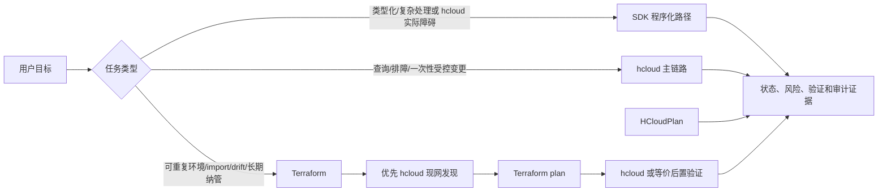

# Cloud Lifecycle Task Scenarios

本文说明 `huaweicloud-skill` 在“上好云、用好云、管好云”中的作用：同一个云上任务，Agent 使用这个 skill 和不使用它，在执行流程、风险控制、结果验证和治理沉淀上有什么区别。

这里讨论的是 Agent 的执行方式，不是让用户手动学习 KooCLI。用户仍然用自然语言提出目标；`huaweicloud-skill` 负责把目标拆成可发现、可规划、可执行、可验证、可审计的步骤。

## 一句话概括

不使用 skill 时，Agent 容易从用户目标直接跳到一条 `hcloud` 命令或一个笼统建议。

使用 skill 时，Agent 会按云任务闭环推进：

```text
上下文与依赖发现
-> 操作与参数规划
-> 风险与安全门禁
-> 受控执行与错误处理
-> 运行后验证
-> 治理与审计沉淀
```

这个闭环是 `huaweicloud-skill` 的核心价值。它不是简单增加更多 API 名称，而是减少云上任务里最常见的误判：账号上下文错、参数拼错、依赖缺失、风险没拦住、API 成功被误认为业务成功、治理结论没有证据。

## 总体差异

| 维度 | 不使用 huaweicloud-skill | 使用 huaweicloud-skill |
| --- | --- | --- |
| 任务拆解 | 直接从用户目标跳到一条命令或一段建议。 | 先识别任务属于上云、用云还是管云，再拆成 context、discovery、plan、execute、verify、audit。 |
| API 选择 | 依赖模型记忆或临时猜 service/operation 名。 | 先查 `service-registry.json`、generated catalog、本地 meta cache 和 `hcloud --help`，再选择 operation。 |
| 上下文确认 | 容易忽略 profile、region、project、domain、OBS endpoint 等前提。 | 先用 `hcloud_context_inspect.py` 检查本机 KooCLI、profile、region、project、认证和 cache。 |
| 参数构造 | 容易漏必填字段、资源 ID、`--cli-output=json` 或复杂 JSON body。 | 通过 discovery/query/planner 脚本生成 JSON-friendly 命令；目标型查询必须显式提供资源参数。 |
| 变更控制 | 创建、删除、绑定、扩容、开放端口等操作可能直接提交。 | 默认 plan-first；高风险操作需要 dry-run、显式确认、plan-bound token 和后置验证。 |
| 错误处理 | 失败后靠自然语言猜是权限、region、参数还是网络问题。 | `hcloud_safe_exec.py` 输出结构化错误，便于按认证、权限、region/project、参数、云端错误分桶处理。 |
| 结果判断 | API 返回成功容易被当成任务完成。 | 区分 job 终态、资源终态、机内状态、应用可达性、日志/指标证据和治理证据。 |
| 治理边界 | 容易把资源清单、资源状态或规格推导成治理结论。 | 对闲置、回收、账单、合规、告警等任务保持 planner-only 或只读边界，不把候选结论当执行授权。 |

## 执行面选择框架

Skill 不只是“hcloud 脚本集合”。开发者和 Agent 先判断任务应进入哪个后端：默认优先 hcloud，
SDK 用于程序化/复杂处理或 hcloud 实际障碍，Terraform 由 IaC 意图触发。



| 执行面 | 什么时候使用 | 产出 | 不能做什么 |
| --- | --- | --- | --- |
| hcloud | 用户要查状态、排障、盘点、做一次性受控变更，或需要验证资源真实状态。 | JSON-friendly 命令、结构化错误、planner、dry-run、guarded submit、readiness/verifier。 | 不适合长期环境复制和 IaC 纳管。 |
| SDK | 类型化请求、复杂 body、分页/并发、结构化异常，或 hcloud metadata/覆盖/解析存在实际障碍。 | SDK metadata、任务专用程序和结构化 API 结果；高频只读可复用便捷 runner。 | 不把便捷 runner allowlist 当全局禁令；变更仍需授权和回读。 |
| Terraform | 用户明确要 IaC、环境复制、import、drift review 或长期纳管。 | 选中的 `.tf` 示例、reference、fmt/init/validate/plan 流程和 apply 后验证清单。 | 不用于普通只读查询、临时排障和绕过用户确认的 apply。 |

## 云任务闭环能力

`huaweicloud-skill` 对用户最直接的价值，可以概括为 6 类能力。

| 闭环能力 | skill 补充了什么 | 典型例子 |
| --- | --- | --- |
| 1. 上下文与依赖发现 | 先确认 `hcloud`、profile、region、project、认证、VPC、子网、安全组、镜像、密钥、EIP 等前提。 | 创建 ECS 前先发现 VPC/subnet/security group、IMS image、KPS keypair。 |
| 2. 操作与参数规划 | 从 registry、catalog、metadata 里找 service/operation，检查必填参数、JSON body、资源 ID、分页、输出格式。 | ECS 创建 JSON 校验；ELB listener/pool/member 分阶段计划；OBS 走专用路径而不是普通 OpenAPI 命令。 |
| 3. 风险与安全门禁 | 对公网暴露、敏感端口、删除/释放、扩容、数据库变更、证书、账单、权限、密钥等动作加 plan、dry-run、显式确认和 hard gate。 | 阻断 `0.0.0.0/0:22`；EIP 绑定要求说明公网暴露和带宽费用；Billing/BSS 不默认 live 查询。 |
| 4. 受控执行与错误处理 | 统一处理超时、脱敏、JSON 解析、认证失败、权限不足、region/project 错误、参数错误和云端错误。 | `hcloud_safe_exec.py` 把失败结构化，Agent 不需要靠猜继续排障。 |
| 5. 运行后验证 | 不把 API 成功当任务完成；继续验证 job、资源状态、绑定关系、ELB 后端、EVS 机内挂载、SSH、HTTP、CES 指标、LTS 日志。 | ECS 创建后继续 `ShowJob`、`ACTIVE`、SSH readiness；ELB 创建后继续看 member health 和 HTTP 探测。 |
| 6. 治理与审计沉淀 | 对盘点、闲置、回收、标签、备份、审计、合规、账单成本生成 evidence、candidate、review plan 和 run journal。 | idle audit 只输出回收候选；teardown plan 只输出评审顺序；Billing/Cost 只生成 request spec。 |

## 闭环成熟度原则

当前说 ECS 是最完整的服务，意思是：ECS 已经有一条相对完整的端到端任务链路，包括创建前依赖发现、JSON 参数校验、风险门禁、dry-run/submit 计划、`ShowJob` 轮询、实例 `ACTIVE` 验证，以及 SSH/应用 readiness 指引。这不等于 ECS 的所有 API 都已经全自动支持，也不等于 ECS `ACTIVE` 后业务一定可用。

ECS 更像当前 skill 的闭环样板：它展示了一个云资源任务不应该只停在“API 调用成功”，而应该继续走到“上下文正确、变更可控、资源状态稳定、业务验收有证据”。

其他服务也应该向闭环演进，但不应该机械地把每个服务、每个 API 都做成 ECS 级别。更合理的方式是按任务价值和风险分层推进：

| 服务或任务类型 | 应该做到的闭环程度 |
| --- | --- |
| 高频上云链路，例如 VPC/安全组、EIP、EVS、ELB、RDS、OBS | 针对最常见任务补齐 discovery、plan、risk gate、verify 和业务验收，不追求一次覆盖所有 API。 |
| 用云排障链路，例如 ECS/EIP/ELB/EVS/CES/LTS | 重点补资源状态、指标、日志、网络和机内状态的证据链，避免靠单个状态字段下结论。 |
| 管云治理链路，例如 TMS、CTS、CBR、RMS/Config、Billing/Cost | 重点补 inventory、candidate、evidence gap、review plan 和边界说明；真实修改策略或账单查询前保持 planner-only 或只读。 |
| metadata-backed 广覆盖服务 | 先支持发现、显式参数只读查询和 planner-only 计划；只有补齐 smoke、playbook、risk profile 和 verifier 后，才逐步晋级为 curated 闭环。 |

因此，后续扩展不应该以“覆盖了多少 API”为唯一目标，而应该以“能否把一个真实用户任务稳定做完”为目标。对于高频、高风险、高价值任务，应该尽量做到 ECS 这种闭环；对于长尾服务，先提供安全发现和只读/计划能力即可。

v0.3.2 开始把这个原则落到一个统一脚本入口：`hcloud_lifecycle_closure_plan.py`。它不是新的 submit 通道，而是把典型服务任务整理成六阶段 planner-only 输出：

```text
上下文与依赖发现
-> 操作与参数规划
-> 风险与安全门禁
-> 受控执行与错误处理
-> 运行后验证
-> 治理与审计沉淀
```

当前 P0 planner 的 `post_change_verification` 阶段还会输出结构化 `acceptance_evidence_plan`。它把每个服务的验收证据拆成云控制面、机内/运行时、协议/网络、可观测性和治理项，并标记哪些证据已经具备输入、哪些还缺 target ID、探测 URL、时间窗口、回滚值等输入。这个字段仍然只是 planner 输出，不会自动执行 live probe。

在这个基础上，`hcloud_acceptance_probe_plan.py` 可以从 lifecycle plan 生成非执行的探测模板，`hcloud_acceptance_evidence_result.py` 可以读取本地 evidence status JSON，把验收结果汇总成 `passed`、`warning`、`missing` 或 `blocked`。这一步补的是“验收证据如何采、采到后如何判定”，仍然不处理真实凭据、不发起云请求、不执行网络探测。

为了避免把不同层级的能力混在一起，当前还提供 `hcloud_closure_maturity_audit.py` 做本地成熟度审计：ECS 是端到端样板，P0 是任务级 planner，P1/P2 是 planner-only，metadata-backed 广覆盖服务在补齐 smoke、playbook、risk profile 和 verifier 前仍是 evidence gap。

P1 进一步把管云治理任务落到 `hcloud_governance_closure_plan.py`。这个入口同样不是 submit 通道，而是把 TMS、CTS、CBR、RMS/Config、Billing/BSS、WAF、DLI、CodeArtsRepo 整理成五阶段 planner-only 输出：

```text
治理范围与输入边界
-> 只读证据计划和 target-scoped 参数缺口
-> 风险与隐私门禁
-> review plan
-> curated 晋级缺口
```

P2 再把后续典型场景落到 `hcloud_p2_scenario_closure_plan.py`。这个入口面向 CCE、NAT、DCS、RFS、UCS、IAM/KPS/IMS、安全姿态和数据库族，不追求把这些服务一次做成 ECS 级自动执行，而是先把“有哪些证据、哪些参数缺口、哪些写操作必须继续门禁”说清楚：

```text
场景范围与必需输入
-> 只读 evidence command plan 和 target-scoped 参数缺口
-> 风险边界
-> 下一步闭环动作
```

v0.3.2 覆盖 P0 任务服务。选择这些服务，是因为它们构成最常见的云上任务链路：网络和安全边界、公网入口、数据盘、负载均衡、数据库、对象存储、域名/证书/CDN，以及指标和日志证据。这个入口的价值不是替代 `hcloud_service_change_plan.py` 或 `hcloud_service_readiness.py`，而是把低层 planner、readiness 和专用适配器组合成用户任务能看懂的闭环计划。

| v0.3.2 P0 服务 | 闭环补强重点 | 仍然保持的边界 |
| --- | --- | --- |
| VPC / 安全组 | 安全组规则读回、CIDR/端口检查、`0.0.0.0/0` 敏感端口 hard block、EIP/ELB 公网路径联动。 | 不自动猜来源 CIDR；不因用户说“公网访问”就开放全网 SSH/Web 端口。 |
| EIP | 绑定/解绑/释放作为公网暴露和费用变更处理，强调同区域、单绑定、带宽和安全组可达性。 | 不把 `ShowPublicip` 成功等同于应用可访问；仍需 ECS/ELB 和安全组验证。 |
| EVS | 区分云侧 `ShowVolume`/attachment 和机内设备、分区、文件系统、挂载、`fstab`、写测试。 | 不把 `in-use` 当成 `/data` 可用；格式化、删除、卸载、扩容必须保留数据风险确认。 |
| ELB | listener、pool、member、health monitor 分阶段计划，强调后端 ECS/VPC/subnet/安全组和健康检查。 | 不把 ELB 资源创建成功当成业务接入成功；member `ONLINE` 和协议探测仍是验收条件。 |
| RDS | 备份、备份策略、参数模板、连接前提、重启影响和回滚边界进入同一个计划。 | 不把实例存在当成数据库可用；涉及生产数据的参数/规格/删除类变更仍需独立确认。 |
| OBS | 走 `hcloud obs`/obsutil 专用路径，检查 bucket stat、policy、lifecycle、公有访问和保留策略风险。 | 不把 OBS 当普通 OpenAPI 服务；不自动公开 bucket，也不自动执行生命周期删除策略。 |
| DNS | 检查记录冲突、TTL、传播窗口、回滚值和解析结果。 | 不把 API 更新成功等同于全网解析完成；仍需等待 TTL 并做解析验证。 |
| SCM | 检查证书状态、域名/SAN、有效期、部署目标和 HTTPS 证书链。 | 不把证书上传成功等同于业务 HTTPS 可用；仍需在真实域名入口验证。 |
| CDN | 检查 CDN 域名、源站、HTTPS、缓存/刷新，以及 CDN 和源站双路径协议探测。 | 不把 CDN 配置成功等同于用户侧访问正确；缓存传播和源站健康仍需验证。 |
| CES / LTS | 组合 CES metric namespace/dimension/time window 发现和 LTS 有界日志证据计划。 | 只做健康证据规划；不创建告警、不修改日志配置、不拉取过宽日志。 |

v0.3.3 补上 P2 场景服务。选择这些服务，是因为它们覆盖了 P0/P1 之外常见的后续任务：容器化应用、私网出公网和 DNAT/SNAT、缓存、IaC、多集群、上云前置依赖、安全姿态和数据库族。P2 当前完成的是“场景闭环计划能力”，不是把所有 P2 服务晋级为完整 curated 执行能力。

| v0.3.3 P2 服务组 | 场景补强重点 | 仍然保持的边界 |
| --- | --- | --- |
| CCE | cluster、node、kubeconfig 边界和 workload readiness 证据。 | 不从本 planner 创建、删除、升级集群，也不落地 kubeconfig token。 |
| NAT | NAT gateway、SNAT/DNAT、route、EIP 绑定和连通性证据。 | DNAT 公网暴露、规则变更和删除仍需 dedicated guarded flow 与显式确认。 |
| DCS | 实例健康、配置、备份、维护窗口和诊断证据。 | 参数、扩容、重启、删除不自动提交。 |
| RFS | stack、template、resource、execution plan 和 drift review。 | 不执行 apply、continue、rollback；模板参数和 outputs 按敏感信息处理。 |
| UCS | fleet、cluster、policy、addon 和多集群治理证据。 | 不修改 federation、policy、addon 或集群接入凭据。 |
| IAM / KPS / IMS | profile、domain、project、keypair、image 等上云依赖证据。 | 不扩展高风险 IAM mutation，不导出或打印私钥。 |
| HSS / SecMaster / CFW / DBSS / KMS | 安全姿态只读可见性和 evidence gap。 | 保持 metadata-backed evidence gap；安全策略、主机 agent、防火墙、审计和密钥变更 hard-gated。 |
| GaussDB / GaussDBforNoSQL / GaussDBforopenGauss / DDS / DDM / DWS | 复用 RDS 的备份、连接、参数、重启影响和回滚证据模型。 | 保持 metadata-backed evidence gap；不从实例状态直接宣称数据库可用，不自动改参数、重启、恢复或删除。 |

v0.4 最初引入 SDK metadata 和小型只读 runner，用来解决 hcloud 缺参数证据的问题。当前模型保留这些
高频资产，同时允许 Agent 在复杂 body、分页/并发或 hcloud 覆盖/解析障碍时编写任务专用 SDK 代码。
runner registry 只限制 runner；SDK 结果按相同完成语义进入 readiness、verifier 或业务验收。

v0.5 的 Terraform 资产面解决的是“长期可重复纳管”的问题，而不是替代一次性排障。典型价值是：
把 ECS + VPC + EIP + 安全组沉淀成可复用 `.tf`，把现网资源 import 到代码管理，或做 drift review。
Terraform 前后优先用 hcloud 发现和验证；不可用时接受等价 SDK/API、data source/provider refresh 和
业务探测证据。

## 服务补充能力总览

从服务视角看，`huaweicloud-skill` 主要补的不是“更多命令”，而是每个服务在真实任务里最容易缺失的判断、门禁和验证环节。

| 服务或服务组 | 主要补充能力 | 对用户的价值 |
| --- | --- | --- |
| ECS | 依赖发现、创建 JSON 校验、登录凭证门禁、安全组风险检查、dry-run/submit 计划、`ShowJob`、`ACTIVE`、SSH/应用 readiness。 | 把“创建请求成功”推进到“服务器可登录、可验收、可继续部署”。 |
| IAM | profile、domain、project、region、认证上下文检查。 | 先确认操作落在正确账号和项目，减少 region/project/权限误判。 |
| VPC / 安全组 | VPC/subnet/security group 发现、CIDR 和端口风险审计、安全组规则计划、`ShowSecurityGroup`/`ShowSecurityGroupRule` 规则 readback。 | 避免网络拓扑不匹配和敏感端口误开放。 |
| IMS / KPS | 镜像、密钥对和私钥处理边界。 | 创建 ECS 前确认镜像可用、登录路径可用。 |
| EIP | EIP/带宽发现、绑定/解绑计划、plan-bound submit token、`ShowPublicip` 验证、公网暴露、同区域单绑定和费用提示。 | 把公网入口变更纳入风险门禁和后置验证。 |
| EVS | 云盘状态、挂载关系、快照姿态、`ShowVolume`/`ShowJob`、机内文件系统、`fstab` 和写测试 readiness。 | 区分“云盘已挂载”和“系统内可用”，降低数据盘误操作风险。 |
| ELB | listener/pool/member/health monitor 拓扑拆解、后端 ECS/VPC/subnet/安全组复核、成员健康和 HTTP/TCP 探测。 | 避免把 ELB 资源创建成功误判成业务已接入。 |
| NAT | NAT gateway、SNAT/DNAT rule、EIP 绑定和路由边界检查。 | 让私网出公网和公网转发任务有清晰依赖和连通性验证。 |
| RDS | 实例、备份、参数模板、连接前提、规格/参数变更影响说明。 | 数据库任务先看备份、重启、连接和回滚边界，避免直接改生产数据库。 |
| OBS | `hcloud obs`/obsutil 专用路径、bucket stat、policy、lifecycle、public ACL/policy 风险检查。 | 避免把 OBS 当普通 OpenAPI 服务，也避免对象存储被错误公开。 |
| DNS / SCM / CDN | 解析、证书、源站、HTTPS、缓存和访问验证。 | 域名、证书和内容分发变更前后都能解释影响范围。 |
| CES / LTS | metric namespace/dimension/time window 发现，log group/stream/keyword/time window 查询计划。 | 健康判断不硬编码指标名，也不拉取过多日志；结论有指标和日志证据。 |
| CCE / UCS | cluster、node、addon、policy 和 fleet 只读 readiness。 | 容器和多集群场景先看状态和边界，写操作不默认开放。 |
| DCS / RFS | 缓存实例健康、备份、配置、诊断；stack/template/resource/execution plan review。 | 缓存和 IaC 任务先看证据和计划影响，再考虑变更。 |
| SDK backend | 官方 SDK package、metadata inspector 和 ECS/IMS/VPC/ELB/RDS/CES/CCE 等 curated 只读 runner。 | 为类型化/复杂任务提供程序化路径；runner 不覆盖长尾时可写任务专用代码。 |
| Terraform assets | provider/reference、示例 `.tf`、import/drift/长期纳管 workflow。 | 当用户要 IaC 时选择少量相关资产，生成可评审计划；用 hcloud 或等价证据发现和验证。 |
| TMS / CTS / CBR / RMS / Config | 标签、审计、备份、合规、资源清单的 candidate、evidence gap 和 review plan。 | 让管云治理从口号变成可盘点、可追踪、可评审的清单。 |
| Billing / Cost / BSS | 能力探测、官方 API request spec、权限和数据敏感边界；不签名、不发请求。 | 成本结论必须来自明确账单数据源，不从资源规格粗略推断费用。 |
| WAF / HSS / SecMaster / CFW / DBSS / KMS | 安全姿态只读发现、policy/host/event/key 等高风险对象的 evidence gap。 | 安全服务先做可见性和证据，不把高风险策略变更过早自动化。 |
| metadata-backed 长尾服务 | service/operation 发现、显式参数只读查询、planner-only 计划、风险分类。 | 覆盖面够宽，但不把未验证能力包装成 curated 闭环。 |

## 典型任务流程对比

下面的任务来自“上云、用云、管云”三类场景。每个任务都展示同一个目标下，不使用 skill 和使用 skill 的执行流程差异。

## 上云任务

### 任务 1：创建一台可登录的 ECS Web 服务器

这个任务不是“调用一次 CreateServers”。对租户来说，真正目标是创建一台上下文正确、网络边界清楚、能登录、能承载应用的服务器。

| 阶段 | 不使用 huaweicloud-skill | 使用 huaweicloud-skill |
| --- | --- | --- |
| 明确上下文 | 可能直接使用默认 region 或模型猜测 project id。 | 先检查 `hcloud`、profile、region、project、认证状态和本地 metadata cache。 |
| 发现依赖 | 可能手写 VPC、subnet、安全组、镜像、规格、密钥字段。 | 用 VPC、IMS、KPS、EIP、ECS discovery/query 路径复核依赖资源和 operation。 |
| 生成创建参数 | 可能漏 `vpcid`、`subnet_id`、`security_groups`、`root_volume`、`key_name` 等字段。 | 用 `hcloud_ecs_create_plan.py` 校验 JSON、必填字段、登录方式、数量上限和占位符。 |
| 风险检查 | 可能开放 `0.0.0.0/0:22` 或常见 Web 端口。 | 对 SSH 和常见 Web 端口阻断全网开放；把费用、网络暴露、登录凭据、回滚边界列出来。 |
| 提交变更 | 可能直接执行创建。 | 先生成 dry-run/safe-exec 计划；真实 submit 前要求用户确认资源、region、project 和风险。 |
| 验收结果 | 可能看到 API 返回或 job 成功就结束。 | 继续用 `ShowJob`、ECS resource verify、SSH readiness、应用端口或 HTTP 验收确认可用。 |

核心差异：不用 skill 时，任务容易停在“创建请求成功”；使用 skill 时，任务推进到“资源存在、状态稳定、可登录、应用验收可解释”。

### 任务 2：给已有 ECS 绑定公网 EIP

这个任务看起来简单，但会影响公网暴露和费用。

| 阶段 | 不使用 huaweicloud-skill | 使用 huaweicloud-skill |
| --- | --- | --- |
| 目标确认 | 可能只拿到 ECS 名称就尝试绑定。 | 先确认 ECS id、目标 EIP、region、project、当前绑定关系和带宽信息。 |
| 操作选择 | 可能猜测 EIP/VPC operation，或者混淆绑定、解绑、更新。 | 通过 EIP registry/catalog 解析目标 operation，并走 `hcloud_eip_change_flow.py`。 |
| 变更计划 | 可能直接拼接 submit 命令。 | 生成 plan、dry-run、plan-bound submit token 和 `ShowPublicip` 验证步骤。 |
| 风险处理 | 可能没有说明公网暴露和带宽费用。 | 明确提示公网入口、带宽计费、现有绑定覆盖和回滚方式。 |
| 后置验证 | 可能只看命令退出码。 | 查询 EIP 绑定状态，并结合 ECS/安全组检查公网可达性前提。 |

核心差异：不用 skill 时，绑定动作容易被当成普通参数更新；使用 skill 时，它被当成公网入口变更来处理。

### 任务 3：为 Web 应用接入 ELB

ELB 不是只创建 listener，还要确认后端 ECS、VPC、协议、端口和健康检查。

| 阶段 | 不使用 huaweicloud-skill | 使用 huaweicloud-skill |
| --- | --- | --- |
| 拓扑理解 | 可能只知道“我要一个负载均衡”。 | 先确认 ELB、VPC/subnet、listener、pool、member、后端 ECS 和应用端口关系。 |
| API 发现 | 可能靠记忆生成 listener/pool/member 操作。 | 通过 catalog/registry 发现 ELB 查询和变更 operation，复杂写操作先 planner-only。 |
| 参数构造 | 容易漏 protocol、port、pool id、member address、subnet 等关键字段。 | 按阶段生成 listener、pool、member 计划，并要求明确后端协议和端口。 |
| 健康判断 | 可能 listener 创建成功就说业务已接入。 | 区分 listener/pool/member 创建成功、后端健康状态和应用 HTTP 可达。 |
| 验收输出 | 可能只返回 ELB id。 | 输出资源状态、后端成员状态、应用探测结果和后续排障入口。 |

核心差异：不用 skill 时，容易把“ELB 资源创建成功”当成“业务接入成功”；使用 skill 时，会继续验证后端和协议层。

## 用云任务

### 任务 4：排查 ECS 访问失败

用户通常只会说“服务器连不上”或“网站打不开”。这类任务需要分层定位，而不是反复重建资源。

| 阶段 | 不使用 huaweicloud-skill | 使用 huaweicloud-skill |
| --- | --- | --- |
| 问题拆分 | 可能直接建议重启 ECS、重装应用或放开安全组。 | 先把问题拆成云资源状态、网络入口、安全组、EIP/ELB、机内服务、应用健康。 |
| 云侧查询 | 可能只看 ECS `ACTIVE`。 | 查询 ECS、EIP、VPC/subnet、安全组、必要时 ELB member 状态。 |
| 命令构造 | 可能漏 `--cli-output=json` 或资源 id。 | 通过 resource query 工具生成显式资源参数的 JSON-friendly 查询。 |
| 风险控制 | 可能建议临时开放 `0.0.0.0/0:22`。 | 对敏感端口全网开放保持阻断或强提示，要求限定来源 CIDR 和过期清理。 |
| 结论表达 | 可能给出单一猜测。 | 输出已验证事实、未验证假设、下一步最小检查和可能的修复顺序。 |

核心差异：不用 skill 时，排障容易跳到“改配置”；使用 skill 时，先收集证据，再做最小风险修复。

### 任务 5：确认 EVS 数据盘已经可用

云侧 `in-use` 只表示云盘挂到了 ECS，不代表业务系统里已经格式化、挂载、可读写。

| 阶段 | 不使用 huaweicloud-skill | 使用 huaweicloud-skill |
| --- | --- | --- |
| 云侧状态 | 可能看到 EVS `in-use` 就判定完成。 | 查询 EVS volume、attachment、目标 ECS 和 AZ/状态。 |
| 机内状态 | 可能忽略文件系统和挂载点。 | 要求继续确认设备识别、分区/文件系统、挂载点、`/etc/fstab` 和读写测试。 |
| 风险识别 | 可能直接建议格式化。 | 把格式化、覆盖已有数据、挂载路径冲突列为高风险确认项。 |
| 结果判断 | 可能只返回云盘 id。 | 区分“云盘已挂载”和“系统内可用”，并输出未完成的机内步骤。 |

核心差异：不用 skill 时，容易把云控制面状态当成业务状态；使用 skill 时，会把云侧和机内验收分开。

### 任务 6：查看资源健康、指标和日志

健康不是一个字段，通常要结合资源状态、CES 指标、LTS 日志和应用探测。

| 阶段 | 不使用 huaweicloud-skill | 使用 huaweicloud-skill |
| --- | --- | --- |
| 指标选择 | 可能硬编码 `cpu_util`、namespace 或 dimension。 | `hcloud_observability_plan.py` 先用 CES `ListMetrics` 发现 namespace、metric、dimension。 |
| 日志查询 | 可能直接拉大时间窗口日志。 | `hcloud_lts_readonly.py` 只生成明确 group/stream、有限时间窗口、有限关键词的只读查询。 |
| 告警处理 | 可能直接建议创建告警。 | `hcloud_ces_alarm_plan.py` 只生成 alarm intent 草案，不创建或修改告警规则。 |
| 结论输出 | 可能把资源 `ACTIVE` 等同于健康。 | 合并资源状态、指标趋势、日志证据和应用可达性，明确证据来源。 |

核心差异：不用 skill 时，健康判断容易依赖猜测或单点状态；使用 skill 时，先发现指标和日志范围，再组合证据。

## 管云任务

### 任务 7：盘点账号里的核心资源

盘点不是“把所有 List API 跑一遍”。它需要受控范围、结构化输出和失败分桶。

| 阶段 | 不使用 huaweicloud-skill | 使用 huaweicloud-skill |
| --- | --- | --- |
| 范围选择 | 可能遗漏 region/project，或者尝试跨所有服务暴力查询。 | `hcloud_account_inventory.py` 先生成核心服务 inventory plan，可按服务过滤。 |
| 查询方式 | 可能混用资源级 Show 和通用 List。 | 区分 query operation 和 resource query operation，只对适合盘点的 List/Count 做计划。 |
| 执行控制 | 可能直接执行大量查询。 | 默认只生成计划；真实查询需要显式 `--execute`。 |
| 错误处理 | 权限、region、参数错误容易混在一起。 | 通过 `hcloud_safe_exec.py` 结构化输出错误，便于按认证、权限、region、参数分桶。 |
| 交付结果 | 可能只是资源列表。 | 输出资源摘要、失败项、后续治理入口和需要用户确认的范围缺口。 |

核心差异：不用 skill 时，盘点容易变成不可控扫描；使用 skill 时，先定义范围和只读计划，再执行可解释查询。

### 任务 8：识别闲置资源并准备回收评审

闲置治理不能从单个字段直接推出删除结论。未绑定、停止、低流量只能说明“需要复核”。

| 阶段 | 不使用 huaweicloud-skill | 使用 huaweicloud-skill |
| --- | --- | --- |
| 候选识别 | 可能看到 EIP 未绑定、ECS stopped、EVS unattached 就建议释放或删除。 | `hcloud_idle_audit.py` 从保存的 JSON 查询结果识别保守候选，只输出 review candidate。 |
| 依赖分析 | 可能忽略 ELB、快照、备份、标签、owner、监控、日志。 | `hcloud_teardown_plan.py` 输出依赖顺序和回收前检查项。 |
| 风险边界 | 可能直接生成删除、释放、退订、停机或缩容命令。 | 明确不生成 destructive submit；删除、释放、退订都需要单独确认和专用流程。 |
| 治理结论 | 可能把“闲置”说成事实。 | 把候选原因、证据来源、缺失证据和人工确认项分开。 |

核心差异：不用 skill 时，治理建议容易越权；使用 skill 时，闲置只是候选，回收前必须补证据。

### 任务 9：检查标签、备份、审计和合规姿态

这类任务属于管云治理，目标是发现治理缺口，不是立即修改策略。

| 阶段 | 不使用 huaweicloud-skill | 使用 huaweicloud-skill |
| --- | --- | --- |
| 治理对象 | 可能泛泛建议“补标签、开备份、开审计”。 | 使用 `hcloud_governance_closure_plan.py` 组合 TMS、CTS、CBR、RMS/Config、WAF、DLI、CodeArtsRepo 的 candidate profile、playbook 和 promotion audit 做目标化检查。 |
| 能力边界 | 可能把 catalog 里存在的 operation 当成熟能力。 | 区分 curated registry、metadata-backed、candidate profile 和 live-smoke 证据。 |
| 计划输出 | 可能直接生成策略修改命令。 | 先输出治理范围、只读 evidence command plan、风险/隐私门禁、review plan、治理汇总和 curated 晋级缺口。 |
| 后续动作 | 可能马上修改审计、备份或合规策略。 | 对策略类变更保持 planner-only 或高风险门禁，要求确认影响范围和回滚方式。 |

核心差异：不用 skill 时，治理容易变成口号或直接改策略；使用 skill 时，先把治理缺口变成可审计的候选清单。

### 任务 10：规划账单和成本分析

成本分析必须来自明确的账单/成本数据源，不能从 ECS、EIP、RDS 等资源规格粗略推断。

| 阶段 | 不使用 huaweicloud-skill | 使用 huaweicloud-skill |
| --- | --- | --- |
| 数据来源 | 可能根据资源规格、带宽或实例数量估算费用。 | 明确要求费用来自账单/成本 API、用户提供数据或官方导出数据。 |
| 能力探测 | 可能直接声称可以查账单。 | `hcloud_governance_closure_plan.py` 和 `hcloud_billing_cost_probe.py` 先确认 Billing/BSS 的 request-spec 能力和证据缺口；metadata-backed `BSS` 不是默认 live 查询授权。 |
| 请求规划 | 可能要求用户提供 AK/SK 并直接请求。 | `hcloud_billing_readonly.py` 只生成 monthly bill summary、cost analysis、resource records 的 request spec，治理 planner 会把这些 spec 放入只读证据计划，且不会生成 live `hcloud BSS` 查询命令。 |
| 安全边界 | 可能访问或展示过多账单明细。 | 不接受 AK/SK，不签名，不发送 HTTP 请求；提示账单数据敏感，输出范围要收窄。 |
| 结论输出 | 可能给出未经验证的费用判断。 | 输出请求路径、参数、权限前提、数据新鲜度和执行方式建议。 |

核心差异：不用 skill 时，容易用资源清单推费用；使用 skill 时，成本结论必须绑定明确账单数据源。

### 任务 11：把现网环境沉淀成 Terraform

这个任务的目标不是马上创建资源，而是把已经明确的云资源结构变成可重复、可评审、可长期纳管的 IaC。

| 阶段 | 不使用 huaweicloud-skill | 使用 huaweicloud-skill |
| --- | --- | --- |
| 进入条件 | 可能只因为 Terraform 可用就强行改写所有任务。 | 先判断用户是否明确需要 IaC、环境复制、import、drift review 或长期纳管。 |
| 现网发现 | 可能直接写 `.tf`，忽略现有 VPC、子网、安全组、EIP、ELB、RDS 等状态。 | 先用 hcloud discovery/query/readiness 获取现网证据和依赖关系。 |
| 资产选择 | 可能浏览大量示例，混用不相关资源。 | 用 `hcloud_terraform_router.py` 从 catalog 中选择少量匹配示例和 reference。 |
| 本地环境 | 可能默认 Terraform/provider 已可用。 | 用 `hcloud_terraform_context_inspect.py` 检查 Terraform CLI、认证环境变量、provider cache 和 forbidden artifact。 |
| 计划执行 | 可能直接 apply 或建议 `-auto-approve`。 | 先 fmt/init/validate/plan，用户确认 exact plan 后才能 apply。 |
| 后置验证 | 可能把 Terraform apply 成功当成业务完成。 | apply 后用 hcloud 或等价实时证据验证资源状态、网络路径和业务 readiness。 |

核心差异：不用 skill 时，Terraform 容易变成另一种直接执行；使用 skill 时，Terraform 是可重复纳管链路，前后都被 hcloud 证据闭合。

## 如何判断 skill 是否真正帮上忙

一个任务使用 `huaweicloud-skill` 后，交付结果应该至少多出以下几类证据之一：

- 上下文证据：当前 profile、region、project、domain、OBS endpoint 是否匹配任务范围。
- API 证据：service/operation 是从 registry、catalog、metadata 或 live help 发现的，不是凭空猜的。
- 参数证据：必填参数、资源 ID、JSON body、分页、输出格式经过检查。
- 风险证据：费用、网络暴露、数据状态、删除/释放、权限和回滚边界被列出。
- 执行证据：dry-run、submit、job、resource verify 或 read-only query 的结构化结果。
- 业务证据：SSH、HTTP、ELB backend、EVS filesystem、CES metric、LTS log 等能证明“可用”的证据。
- 治理证据：owner、tag、backup、trace、compliance、billing request spec 或 teardown precheck。

如果一个回答只是给出一条 `hcloud` 命令，没有说明来源、上下文、参数、风险、验证和边界，那它并没有真正发挥 `huaweicloud-skill` 的价值。
