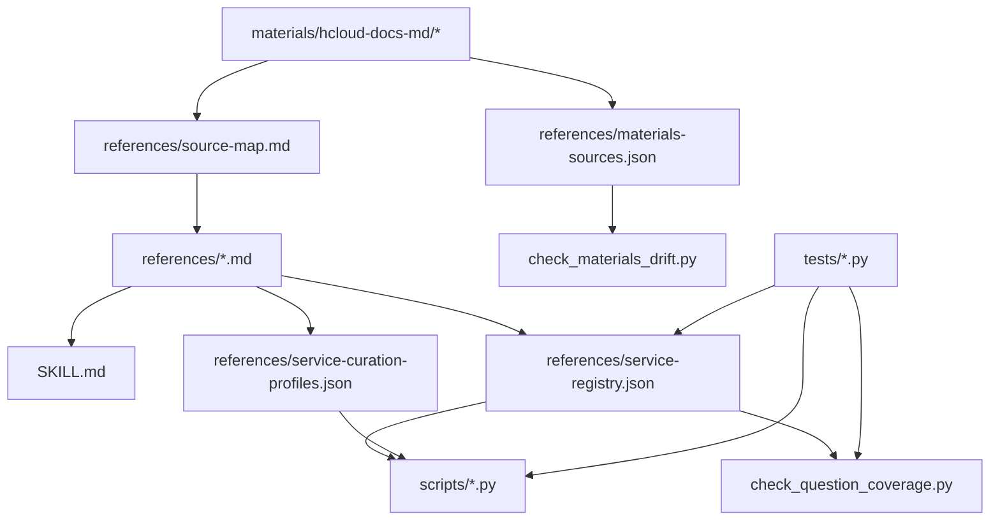

# Data and Coverage

`huaweicloud-skill` 的能力不是只靠代码，还依赖几类仓库内数据资产：清洗后的 references、原始 materials、机器可读 service registry、generated catalog 和测试记录。本文解释这些数据如何组织，以及它们如何约束实现。

文档边界：`references/` 是 agent 运行时资料层，`docs/` 是维护者说明层。覆盖数字以脚本输出和机器可读 JSON 为准，避免在多份文档里重复手写。

## 数据分层



## `references/`

`references/` 是清洗后的运行时资料层。相比 `materials/`，它更稳定、更短，也更贴近 skill 的实际行为。

关键文件：

| 文件 | 用途 |
| --- | --- |
| `workflow.md` | 标准执行流程，从意图分类到上下文、发现、执行、验证。 |
| `auth-and-context.md` | hcloud 认证、profile、region、project 等上下文规则。 |
| `command-construction.md` | 命令构造规则，包括 JSON 输出、`--cli-jsonInput`、`--dryrun`。 |
| `error-playbook.md` | 常见 KooCLI 错误处理策略。 |
| `output-and-query.md` | 输出格式、查询和空响应处理规则。 |
| `cache-prewarm.md` | metadata/help cache 预热说明。 |
| `local-meta-discovery.md` | 本地 meta cache 结构和发现方式。 |
| `service-coverage.md` | 人类可读服务覆盖矩阵。 |
| `service-registry.json` | 机器可读服务覆盖和路由控制面。 |
| `service-curation-profiles.json` | curated 服务维护档案和 metadata-backed 晋级候选门禁。 |
| `hcloud-service-catalog.index.json` | generated catalog 的运行时轻量索引，按服务懒加载。 |
| `hcloud-service-catalog/` | 每服务 generated catalog payload，脚本按需读取。 |
| `hcloud-service-catalog.generated.json` | 可选本地临时 full catalog，仅用于维护期完整 diff；不提交到仓库，不作为 agent 直接资料入口。 |
| `hcloud-service-catalog.fingerprint.json` | generated catalog 的小体积升级审查事实源。 |
| `hcloud-service-confidence.json` | live smoke、confidence 和 dry-run 支持性的人工/实测 sidecar。 |
| `playbooks/` | 面向具体任务的执行手册。 |

generated catalog 由 `scripts/build_hcloud_catalog.py` 从本地 KooCLI `metaRepo` 生成。v0.3.1 起生成器按 operation 粒度英文优先合并：英文 metadata 已有的 operation 保持英文摘要和 detail，中文 metadata 中新增的服务、operation 或 detail 作为 fallback 补齐。当前覆盖数字以 `python3 scripts/hcloud_catalog_audit.py --pretty` 为准；本次 catalog source 为 198 个本地 metadata 服务、15,666 个 operation，metadata-backed registry 外服务为 180 个。

开发时，优先更新 `service-registry.json` 和相关 tests，再更新人类文档。

## `materials/`

`materials/` 保存原始 KooCLI 文档转换结果。它不是运行时规则，只是资料源。

当前主要来源包括：

- KooCLI 用户指南。
- KooCLI 常见问题。
- KooCLI 快速入门。
- KooCLI 产品介绍。
- KooCLI 最新动态。

原始材料存在目录噪声、页码残留、图片占位、命令换行断裂等问题。因此开发时应：

1. 优先读 `references/`。
2. `references/` 没覆盖时再回到 `materials/`。
3. 从 `materials/` 抽取新规则后，沉淀到 `references/`。
4. 维护 `references/materials-sources.json` 的映射。

## Materials drift check

`scripts/check_materials_drift.py` 检查 `references/materials-sources.json` 中声明的 reference 和 material 文件是否存在，以及 material 是否比 reference 更新。

输出中每条 finding 有：

- `reference`
- `materials`
- `missing`
- `newer_materials`
- `status`

如果原始材料比清洗后的 reference 更新，说明 reference 可能需要重新检查。

## Service registry

`references/service-registry.json` 是最重要的数据文件。它驱动通用 discovery、resource query、service readiness、smoke、planner 和 coverage 检查。

`references/service-curation-profiles.json` 是 registry 的维护档案，不直接让服务进入 curated registry。它用于记录已有 curated 服务和候选服务的 readiness operation、resource query operation、playbook、risk profile 和可选价值标签，并由 `scripts/hcloud_curated_promotion_audit.py` 校验。

当前 registry 摘要以脚本输出为准：

```bash
python3 scripts/hcloud_catalog_audit.py --pretty
```

读取 `registry.service_count`、`registry.query_operation_count`、`registry.resource_query_operation_count`、`registry.change_operation_count` 和 `registry.registered_operation_count`。这些数字的含义是“skill 已经能识别、规划或生成对应执行路径”，不是“所有 operation 都可以无确认真实提交”。写类 operation 仍受 planner、dry-run、显式确认和后置验证约束。

### 顶层结构

```json
{
  "version": 1,
  "services": {
    "ECS": {
      "coverage": "high",
      "default_region_required": true,
      "query_operations": [],
      "resource_query_operations": [],
      "change_operations": [],
      "planner": "scripts/hcloud_ecs_create_plan.py",
      "job_verifier": "scripts/hcloud_ecs_wait_job.py",
      "resource_verifier": "scripts/hcloud_ecs_verify_active.py",
      "playbooks": [],
      "official_docs": [],
      "known_limits": []
    }
  }
}
```

### 常用字段

| 字段 | 含义 |
| --- | --- |
| `coverage` | skill 内部覆盖等级：`high`、`medium`、`low`。 |
| `default_region_required` | 默认是否需要 region。 |
| `supported_cli_regions` | 某些服务的 KooCLI 可接受 region 白名单，例如 CDN。 |
| `preferred_cli_region` | 当请求 region 不支持时的默认替代 region。 |
| `query_runner` | list-only 查询专用 runner。缺省是 `scripts/hcloud_resource_discovery.py`。 |
| `resource_query_runner` | 资源级查询专用 runner。缺省是 `scripts/hcloud_resource_query.py`。 |
| `query_operations` | 可作为通用发现入口的 read-only operation。 |
| `resource_query_operations` | 需要目标资源 ID 或上下文的 read-only operation。 |
| `change_operations` | 已纳入 planner-only 或专用 flow 的变更 operation。 |
| `planner` | 变更规划脚本。 |
| `job_verifier` | 异步 job 验证脚本。 |
| `resource_verifier` | 资源状态验证脚本。 |
| `playbooks` | 对应服务或场景的参考手册。 |
| `known_limits` | 当前实现边界和已知限制。 |

### Curation profile 字段

| 字段 | 含义 |
| --- | --- |
| `status` | `curated` 或 `candidate`。 |
| `target_coverage` | 目标覆盖等级。 |
| `readiness_operations` | 服务级 readiness 或 inventory 起点。 |
| `resource_query_operations` | 需要目标参数的资源级只读查询。 |
| `playbooks` | 对应维护手册路径，文件必须存在。 |
| `risk_profile` | mutation 风险姿态，必须声明 mutation policy、default risk、submit policy 和 verification policy。 |
| `lifecycle_stage` | 可选字段，说明该服务处在 curated、candidate grooming 等生命周期阶段。 |
| `user_value` | 可选字段，说明该服务对用户“上好云、用好云、管好云”的价值。 |
| `tenant_goal_tags` | 可选字段，常见值为 `上好云`、`用好云`、`管好云`。 |
| `scenario_tags` | 可选字段，用于标记 audit、backup、logs、tagging、compliance 等场景。 |

### Operation 分类

`query_operations` 和 `resource_query_operations` 的区别是扩展服务时最容易出错的地方。

`query_operations` 应满足：

- 没有资源 ID 也能执行。
- 适合做服务现状发现。
- 常见形式是 `List*`、`Count*`、部分 `ShowQuota*`。

`resource_query_operations` 应满足：

- 需要明确资源 ID、name 或父资源 ID。
- 不适合通用 smoke 自动执行。
- 常见形式是 `Show*` 或资源作用域下的 `List*`，例如 ELB `ListMembers` 需要 `pool_id`。

`change_operations` 表示“可以被 planner 识别”，不等于“可以自动执行真实变更”。除非有专门 flow 和确认门禁，否则默认 planner-only。

当前已有两类 change flow：

- EIP 专用 flow：`scripts/hcloud_eip_change_flow.py`，Plan -> dry-run -> guarded submit -> `ShowPublicip` verify。
- 多服务通用 flow：`scripts/hcloud_guarded_change_flow.py`，覆盖 VPC、ELB、EVS、NAT、RDS、CDN、DNS、SCM，Plan -> dry-run -> guarded submit -> resource Show* verify -> read-only smoke。

当前还有几类 lifecycle planner，它们不等同于真实写操作：

- 账号盘点：`scripts/hcloud_account_inventory.py` 生成核心服务只读 inventory 计划。
- 闲置审计：`scripts/hcloud_idle_audit.py` 从保存的 JSON 输出识别保守候选，不生成删除命令。
- 回收评审：`scripts/hcloud_teardown_plan.py` 生成依赖顺序和回收前检查项，所有步骤都是 planner-only。
- 可观测：`scripts/hcloud_observability_plan.py`、`scripts/hcloud_ces_alarm_plan.py`、`scripts/hcloud_lts_readonly.py` 分别处理资源状态/CES metric、CES alarm 草案和 LTS 只读日志查询。
- Billing/Cost：`scripts/hcloud_billing_readonly.py` 只生成官方 API request spec，不签名、不发请求。
- 任务闭环：`scripts/hcloud_lifecycle_closure_plan.py` 为 VPC/安全组、EIP、EVS、ELB、RDS、OBS、DNS、SCM、CDN、CES/LTS 生成六阶段 lifecycle closure 计划，不执行真实云变更。
- 治理闭环：`scripts/hcloud_governance_closure_plan.py` 为 TMS、CTS、CBR、RMS/Config、Billing/BSS、WAF、DLI、CodeArtsRepo 生成五阶段 governance closure 计划，不执行治理写操作。
- P2 场景闭环：`scripts/hcloud_p2_scenario_closure_plan.py` 为 CCE、NAT、DCS、RFS、UCS、IAM/KPS/IMS、安全姿态和数据库族生成四阶段 scenario closure 计划，不执行集群、NAT、缓存、IaC、多集群、安全、密钥或数据库写操作。

## Coverage gate

`scripts/check_question_coverage.py` 是 registry 覆盖和风险分类的质量门禁入口。开发者只需要理解它在本仓库中的作用：

- 复用 `hcloud_change_plan.assess_risk()` 检查风险分类规则。
- 检查 service registry 中的 operation 是否能映射到查询、资源查询、planner 或 guarded flow。
- 检查 operation alias 是否能映射到真实 KooCLI operation，例如 RDS 配置详情查询映射到 `ShowConfiguration`。
- 对架构契约测试提供 fixture 级别的安全回归能力。

扩展 registry 或风险判断时，应同步更新该脚本和相关契约测试，确保 coverage 和安全边界没有退化。

## 测试体系

### 单元测试

`tests/test_hcloud_safe_exec.py`、`tests/test_hcloud_meta_lookup.py`、`tests/test_hcloud_ecs_create_plan.py` 等文件覆盖单个脚本的核心逻辑。

### 多服务工具测试

`tests/test_hcloud_multiservice_tools.py` 覆盖：

- smoke plan。
- OBS runner 路由。
- resource query 参数校验。
- EIP guarded flow。
- 多服务通用 guarded flow 的资源级 Show* 后置验证、缺参、submit 结果 ID 提取和显式 verify operation。
- OBS planner-only。
- service readiness。
- resource verifier。
- CDN region resolution。
- service change plan 约束。

这些测试不调用真实 `hcloud`，主要验证输出契约和路由逻辑。

### 架构契约测试

`tests/test_hcloud_architecture_contracts.py` 约束更高层的不变量：

- registry 中 high coverage 服务必须有 playbook、planner、resource verifier。
- registry 中 playbook 路径必须存在。
- discovery 命令必须 JSON-friendly。
- resource-scoped query 不得误作为 generic discovery。
- 风险分类必须符合预期。
- materials mapping 必须 well formed。
- coverage 检查必须能识别安全 fixture。

开发者修改 registry 或风险判断时，应优先看这个测试文件。

## 当前覆盖摘要

当前覆盖状态可以理解为三层：

| 层级 | 服务 | 当前能力 |
| --- | --- | --- |
| 完整闭环 | ECS | 查询、创建 JSON 校验、dry-run/submit 命令生成、job 轮询、ACTIVE 验证。 |
| P0 任务闭环增强 | VPC/安全组、EIP、EVS、ELB、RDS、OBS、DNS、SCM、CDN、CES/LTS | 保持原有 guarded/readiness/专用适配器边界，同时通过 `hcloud_lifecycle_closure_plan.py` 输出上下文发现、参数检查、风险门禁、受控执行、后置验证和治理审计。 |
| P1 治理闭环计划 | TMS、CTS、CBR、RMS/Config、Billing/BSS、WAF、DLI、CodeArtsRepo | 通过 `hcloud_governance_closure_plan.py` 输出治理范围、只读 evidence command plan、风险/隐私门禁、review plan、治理汇总和 curated 晋级缺口；不执行治理写操作，Billing/BSS 不生成 live query 命令。 |
| P2 场景闭环计划 | CCE、NAT、DCS、RFS、UCS、IAM/KPS/IMS、安全姿态服务、数据库族 | 通过 `hcloud_p2_scenario_closure_plan.py` 输出场景范围、只读 evidence command plan、风险边界和下一步晋级缺口；CCE/NAT/DCS/RFS/UCS/IAM/KPS/IMS 复用已有 profile，安全姿态和数据库族保持 metadata evidence gap。 |
| 晋级候选 | LTS 及后续治理/安全/数据库长尾服务 | 有 candidate profile、playbook、risk profile 或 metadata-backed 入口；是否晋级取决于 live read-smoke、目标查询、playbook、risk profile 和测试证据。 |

OBS 是特殊服务，不通过普通 OpenAPI-style metadata，而通过 `hcloud obs`/obsutil 适配。

## 当前验证摘要

当前验证状态以本地回归命令为准：

```bash
python3 -m unittest discover tests
python3 scripts/hcloud_catalog_audit.py --fail-on-drift --pretty
python3 scripts/check_materials_drift.py --pretty
python3 scripts/check_question_coverage.py --pretty
```

这组验证说明项目不是只写了文档和脚本，而是把覆盖、风险和执行路径纳入了可重复检查的质量门禁。涉及 guarded flow 的能力还应检查对应单测和只读 smoke 输出，不在本文硬编码一次性测试数量。

## 新增或提升覆盖时的 checklist

扩展 `service-registry.json` 时，建议检查：

- 新 service 是否有正确 `coverage`。
- list 型 operation 是否放入 `query_operations`。
- 需要资源 ID 的 operation 是否放入 `resource_query_operations`。
- change operation 是否有 planner 或 known limit。
- change operation 是否需要接入通用 guarded flow 或专用 flow。
- 后置验证能否安全映射到 Show* operation；如果能，是否补齐 required params。
- 有专用命令形态时是否配置 `query_runner` 或 `resource_query_runner`。
- playbook 路径是否存在。
- `known_limits` 是否诚实描述当前边界。

扩展脚本时，建议检查：

- 是否默认 JSON 输出。
- 是否经过 `hcloud_safe_exec.py`。
- 是否对敏感读取做门禁。
- 是否避免猜测资源 ID。
- 是否能输出机器可读失败原因。
- 是否有单测覆盖 plan 模式，不依赖真实云账号。

扩展 coverage 门禁时，建议检查：

- operation alias 是否必要。
- operation 归一化是否会误判服务或资源名。
- coverage ratio 是否合理，避免把低价值 operation 大量塞进 registry。

## 推荐验证命令

完整本地回归：

```bash
python3 -m unittest discover tests
python3 scripts/check_materials_drift.py --pretty
```

只验证 registry 和多服务脚本契约时：

```bash
python3 -m unittest tests.test_hcloud_architecture_contracts tests.test_hcloud_multiservice_tools
```

只改文档时：

```bash
git diff --check
```
