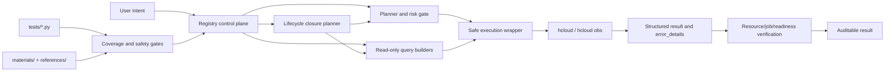

# Technical Overview

`huaweicloud-skill` 是一个基于华为云 KooCLI (`hcloud`) 的执行型 skill。它的技术目标不是把云命令写进提示词，而是把 LLM 的云资源操作拆成可发现、可规划、可执行、可验证、可回归的工程链路。

## 技术定位

这个 skill 让 agent 能用 `hcloud` 查询、分析、规划和验证华为云资源操作。对于会影响费用、网络、可用性或数据状态的变更，默认走 plan、dry-run、显式确认和后置验证，而不是直接提交。

## 设计动机

云资源操作和普通代码生成不同，失败成本更高：

- 参数错了会直接请求云 API。
- region、project、profile、OBS 凭证等上下文错了会误判资源不存在。
- job 成功不等于资源可用。
- 部分服务本地 KooCLI metadata 不完整，模型容易猜参数。
- 写类操作可能产生费用、影响网络连通性或破坏数据状态。

因此，skill 把这些风险收敛到框架层：先发现、再计划、再执行、最后验证，并让每一步都有机器可读输出。

## 当前能力概览

v0.3 已经从 v0.1 的 ECS/基础工具能力，扩展为多服务执行框架和生命周期治理工具：

| 指标 | 当前状态 |
| --- | --- |
| curated registry | 服务数和 operation 计数以 `hcloud_catalog_audit.py --pretty` 的 `registry` 字段为准 |
| metadata-backed catalog | 服务数、operation 数和 registry 外服务清单以 `hcloud_catalog_audit.py --pretty` 的 `catalog` / `metadata_backed` 字段为准 |
| 自动化测试 | 以 `python3 -m unittest discover tests` 的当前结果为准 |
| 质量门禁 | 单测、架构契约、materials drift、registry/coverage 检查 |
| 发布版本 | `v0.3 / 0.3.2` |

## 核心架构

### 1. Registry 控制面

`references/service-registry.json` 是机器可读服务能力索引。它把每个服务的 query、resource query、change operation、planner、verifier、playbook 和 known limits 统一登记。

这让 agent 不需要凭记忆猜“哪个服务能做什么”，而是先查 registry，再决定走发现、资源查询、readiness、planner 或专用 flow。

### 2. Safe exec 执行面

`hcloud_safe_exec.py` 统一包装真实命令执行：

- 默认 JSON 输出。
- 命令和输出脱敏。
- 结构化 stdout/stderr/return code。
- 解析 JSON。
- 生成 `error_details`，区分 credential、permission、region/project、quota、parameter、not_found、network、metadata、cloud_api 等错误。

这使上层 agent 能判断下一步是让用户修配置、换 region、补参数、处理权限，还是停止重试。

### 3. Guarded change 安全面

写类操作默认不直接执行。当前已有三层能力：

- ECS 专用闭环：创建 JSON 校验、dry-run、submit 命令、`ShowJob` 轮询、`ACTIVE` 验证。
- EIP 专用闭环：Plan -> dry-run -> guarded submit -> `ShowPublicip` verify。
- 多服务通用闭环：VPC、ELB、EVS、NAT、RDS、CDN、DNS、SCM 走 Plan -> dry-run -> guarded submit -> resource Show* verify -> service smoke。

通用 guarded flow 支持从 submit 结果提取资源 ID，也支持显式 `--verify-param KEY=VALUE`。缺少目标 ID 时返回 `missing_params`，不会猜资源。

### 4. 验证面

当前版本明确区分几类验证：

- job 终态验证：例如 ECS `ShowJob`。
- 资源终态验证：例如 ECS `ListServersDetails` 达到 `ACTIVE`。
- 资源级 Show* 验证：例如 `ShowSecurityGroupRule`、`ShowListener`、`ShowVolume`、`ShowNatGatewayDnatRule`、`ShowDomain`、`ShowRecordSet`。
- 服务级 readiness：例如 VPC/RDS/ELB 等服务的一组只读状态检查。
- JSON verifier：对 EIP、VPC、ELB、EVS、NAT、RDS、CCE、CDN、DNS、SCM 等服务返回结构做 ID/name/status/CIDR/绑定关系验证。

核心原则是：请求提交成功不等于业务完成；必须继续验证目标资源状态。

### 4.1 任务闭环层

`hcloud_lifecycle_closure_plan.py` 是 v0.3.2 增加的任务闭环层。它不直接执行云命令，也不替代服务级 guarded flow，而是把 P0 服务的典型任务组合成六阶段 planner-only 输出。当前 P0 范围包括 VPC/安全组、EIP、EVS、ELB、RDS、OBS、DNS、SCM、CDN、CES/LTS：

- 上下文与依赖发现。
- 操作与参数规划。
- 风险与安全门禁。
- 受控执行与错误处理。
- 运行后验证。
- 治理与审计沉淀。

这个脚本复用 `hcloud_service_change_plan.py`、`hcloud_service_readiness.py`、OBS/LTS 专用适配器和本地安全策略扫描。它的工程意义是让“上好云、用好云、管好云”从文档原则变成机器可读计划，同时保持真实 submit 仍由现有确认门禁控制。

### 4.2 治理闭环层

`hcloud_governance_closure_plan.py` 是 P1 增加的治理闭环层。它面向“管好云”的治理任务，不直接执行云命令，也不开放治理写操作，而是把 TMS、CTS、CBR、RMS/Config、Billing/BSS、WAF、DLI、CodeArtsRepo 组织成五阶段 planner-only 输出：

- 治理范围与输入边界。
- 只读证据计划。
- 风险与隐私门禁。
- review plan。
- curated 晋级缺口。

这个脚本复用 `service-curation-profiles.json`、`hcloud_curated_promotion_audit.py` 和 `hcloud_billing_readonly.py`。它的工程意义是把标签、审计、备份、合规、账单、安全、数据分析和 DevOps 这类治理任务先收敛成可审计、可评审、可逐步晋级的证据链，而不是过早打开自动写策略。

### 5. 质量回归面

质量门禁把 registry、风险分类、执行路径和资料漂移纳入可重复检查：

- 单测检查脚本输出契约、风险门禁、参数缺失和路由逻辑。
- 架构契约检查 registry 中 runner、planner、verifier、playbook 路径和覆盖等级。
- `check_materials_drift.py` 检查 `references/` 与 `materials/` 的来源映射是否仍然有效。
- `check_question_coverage.py` 检查 registry 覆盖和风险分类规则，作为扩展服务时的回归入口。

这让服务覆盖不是靠人工印象，而是可以持续回归。

## 技术优势

| 常见问题 | 本 skill 的处理方式 |
| --- | --- |
| 模型直接拼命令，容易猜错参数 | 通过 registry、metadata 和脚本生成命令 |
| 查询和写操作混在一起 | 查询、资源级查询、planner、guarded submit 分层 |
| 提交成功就误判完成 | job、资源状态、readiness 分层验证 |
| 失败后只能自然语言猜原因 | `error_details` 给机器可读错误类别 |
| 覆盖范围难以回归 | registry 检查、materials drift、契约测试回归 |
| OBS 被误当成普通 OpenAPI 服务 | OBS 走 `hcloud obs`/obsutil 专用路径 |

## 典型开发入口

- 新增服务覆盖：优先改 `references/service-registry.json`，再补 query/readiness/verifier/tests。
- 新增只读查询：优先走 `hcloud_resource_discovery.py` 或 `hcloud_resource_query.py`。
- 新增写类能力：先接入 planner-only，再补 guarded flow 或专用 flow。
- 新增后置验证：优先补 Show* resource query 和 verifier 规则。
- 调整安全边界：同步修改风险分类、架构契约测试和覆盖检查。

## 当前边界

- ECS 是完整度最高的闭环；其他 curated 服务已具备 profile/playbook/risk-profile 维护档案和广度优先的 P0 风险门禁，但复杂业务语义 verifier 还需要继续扩展。
- 非 ECS 服务的部分 KooCLI operation detail 在本地 metadata 中不完整，所以当前仍优先采用显式参数和 planner-first。
- 账号盘点、闲置审计、teardown review、CES alarm、LTS log 和 Billing/Cost 都是只读或 planner-only 路线，不代表默认可以执行删除、释放、退订、告警创建或账单 HTTP 请求。
- 通用 Show* 后置验证确认基础资源状态，不等同于完整业务验收。
- 所有真实写操作仍需要用户按具体资源、region、project、风险和回滚方式确认。

## 后续技术路线

1. 扩展更多服务专用 verifier，把通用 Show* 验证升级为更强的业务语义验证。
2. 增加更多真实只读样本和 dry-run 样本，继续校准 registry 和参数白名单。
3. WAF、CodeArtsRepo、DLI 已达到当前 promotion audit 证据线，但是否写入 registry 仍取决于维护决策；CTS、TMS、CBR、RMS、Config、LTS 需要继续补 live read-smoke 证据。
4. 为 Billing/Cost 增加经过评审的签名请求 runner 或 SDK 路线前，继续保持 request-spec-only。
5. 把 run journal 用到更多多步操作中，增强真实变更的审计和恢复能力。
