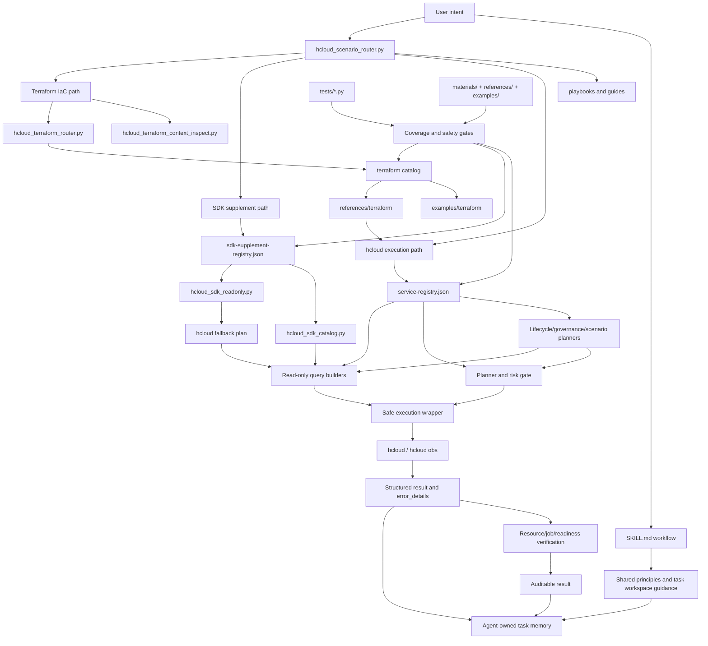
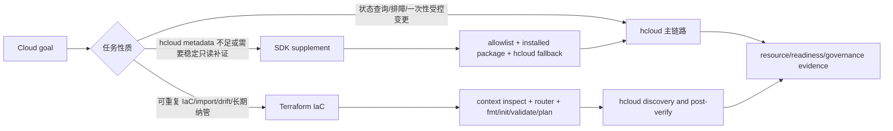

# Technical Overview

`huaweicloud-skill` 是一个 hcloud-first 的华为云执行型 skill。它的技术目标不是把云命令写进提示词，也不是把 SDK、Terraform 和 CLI 都做成大而全入口，而是把 LLM 的云资源操作拆成可发现、可规划、可执行、可验证、可回归的工程链路。

## 技术定位

这个 skill 让 agent 能以 `hcloud` 为主链路查询、分析、规划和验证华为云资源操作。SDK 和 Terraform 都是补充能力：

- SDK 用于补充参数类型、region/endpoint、错误结构和少量 allowlist 内稳定只读查询。
- Terraform 用于可重复 IaC、环境复制、长期纳管、import 和 drift review。

对于会影响费用、网络、可用性或数据状态的变更，默认走 plan、dry-run、显式确认和后置验证，而不是直接提交。

## 设计动机

云资源操作和普通代码生成不同，失败成本更高：

- 参数错了会直接请求云 API。
- region、project、profile、OBS 凭证等上下文错了会误判资源不存在。
- job 成功不等于资源可用。
- 部分服务本地 KooCLI metadata 不完整，模型容易猜参数。
- 写类操作可能产生费用、影响网络连通性或破坏数据状态。

因此，skill 把这些风险收敛到框架层：先发现、再计划、再执行、最后验证，并让每一步都有机器可读输出。

## 当前能力概览

在 v0.9.1 统一任务机制基线之上，当前能力已从 v0.1 的 ECS/基础工具扩展为多服务执行框架、生命周期治理工具、SDK 补充层、Terraform 资产面，以及跨服务共享、Agent workspace 任务记忆、用户状态投影和知识渐进加载机制：

| 指标 | 当前状态 |
| --- | --- |
| curated registry | 服务数和 operation 计数以 `hcloud_catalog_audit.py --pretty` 的 `registry` 字段为准 |
| metadata-backed catalog | 服务数、operation 数和 registry 外服务清单以 `hcloud_catalog_audit.py --pretty` 的 `catalog` / `metadata_backed` 字段为准 |
| SDK supplement | allowlist 以 `references/sdk-supplement-registry.json` 为准；运行时优先使用已安装 `huaweicloudsdk*` package |
| Terraform assets | 示例和 reference 以 `references/terraform/catalog/*.json`、`examples/terraform/` 和 `references/terraform/` 为准 |
| 统一任务机制 | `references/unified-principles.md`、`references/task-workspace-guide.md`、`templates/` 和统一机制契约测试 |
| Plus 共享组织 | `references/goal-capability-guide.md`、`references/interaction-guidance.md`、`references/source-map.md`；新增行为收益待用户验证 |
| 自动化测试 | 以 `python3 -m unittest discover tests` 的当前结果为准 |
| 质量门禁 | 单测、架构契约、materials drift、registry/coverage 检查 |

## 核心架构

## 执行面选择框架

开发者扩展能力时，先判断任务应该进入哪个执行面，而不是先问“能不能用某个工具”。

| 执行面 | 适合场景 | 不适合场景 | 关键边界 |
| --- | --- | --- | --- |
| hcloud | live 查询、排障、上下文发现、受控 dry-run/submit、后置验证。 | 长期环境复制和批量 IaC 纳管。 | 所有真实写操作仍要确认、dry-run 和验证。 |
| SDK | hcloud metadata/help 不足时补参数、endpoint、request model、错误结构；少量稳定只读查询。 | 通用创建、修改、删除、启停、扩缩容。 | 只走 `sdk-supplement-registry.json` allowlist；机器上只要求已安装 package，不要求 SDK 源码。 |
| Terraform | 可重复创建、环境复制、import、drift review、长期纳管。 | 只读状态核验、临时排障、一次性小变更。 | 先路由少量资产；apply 前必须确认 exact plan，apply 后回到 hcloud 验证。 |

### 1. Registry 控制面

`references/service-registry.json` 是机器可读服务能力索引。它把每个服务的 query、resource query、change operation、planner、verifier、playbook 和 known limits 统一登记。

这让 agent 不需要凭记忆猜“哪个服务能做什么”，而是先查 registry，再决定走发现、资源查询、readiness、planner 或专用 flow。

### 2. Safe exec 执行面

`hcloud_safe_exec.py` 统一包装真实命令执行：

- 默认 JSON 输出。
- 命令和输出脱敏。
- 结构化 stdout/stderr/return code。
- 解析 JSON。
- 生成 `error_details`，区分 credential、permission、region/project、quota、parameter、not_found、network、metadata、cloud_api 等错误。

这使上层 agent 能判断下一步是让用户修配置、换 region、补参数、处理权限，还是停止重试。

### 3. Guarded change 安全面

写类操作默认不直接执行。当前已有三层能力：

- ECS 专用闭环：创建 JSON 校验、dry-run、submit 命令、`ShowJob` 轮询、`ACTIVE` 验证。
- EIP 专用闭环：Plan -> dry-run -> guarded submit -> `ShowPublicip` verify。
- 多服务通用闭环：VPC、ELB、EVS、NAT、RDS、CDN、DNS、SCM 走 Plan -> dry-run -> guarded submit -> resource Show* verify -> service smoke。

通用 guarded flow 支持从 submit 结果提取资源 ID，也支持显式 `--verify-param KEY=VALUE`。缺少目标 ID 时返回 `missing_params`，不会猜资源。

### 4. 验证面

当前版本明确区分几类验证：

- job 终态验证：例如 ECS `ShowJob`。
- 资源终态验证：例如 ECS `ListServersDetails` 达到 `ACTIVE`。
- 资源级 Show* 验证：例如 `ShowSecurityGroupRule`、`ShowListener`、`ShowVolume`、`ShowNatGatewayDnatRule`、`ShowDomain`、`ShowRecordSet`。
- 服务级 readiness：例如 VPC/RDS/ELB 等服务的一组只读状态检查。
- JSON verifier：对 EIP、VPC、ELB、EVS、NAT、RDS、CCE、CDN、DNS、SCM 等服务返回结构做 ID/name/status/CIDR/绑定关系验证。

核心原则是：请求提交成功不等于业务完成；必须继续验证目标资源状态。

### 4.1 任务闭环层

`hcloud_lifecycle_closure_plan.py` 是 v0.3.2 增加的任务闭环层。它不直接执行云命令，也不替代服务级 guarded flow，而是把 P0 服务的典型任务组合成六阶段 planner-only 输出。当前 P0 范围包括 VPC/安全组、EIP、EVS、ELB、RDS、OBS、DNS、SCM、CDN、CES/LTS：

- 上下文与依赖发现。
- 操作与参数规划。
- 风险与安全门禁。
- 受控执行与错误处理。
- 运行后验证。
- 治理与审计沉淀。

这个脚本复用 `hcloud_service_change_plan.py`、`hcloud_service_readiness.py`、OBS/LTS 专用适配器和本地安全策略扫描。它的工程意义是让“上好云、用好云、管好云”从文档原则变成机器可读计划，同时保持真实 submit 仍由现有确认门禁控制。

### 4.2 治理闭环层

`hcloud_governance_closure_plan.py` 是 P1 增加的治理闭环层。它面向“管好云”的治理任务，不直接执行云命令，也不开放治理写操作，而是把 TMS、CTS、CBR、RMS/Config、Billing/BSS、WAF、DLI、CodeArtsRepo 组织成五阶段 planner-only 输出：

- 治理范围与输入边界。
- 只读证据计划，包括 evidence command plan 和 target-scoped 参数缺口。
- 风险与隐私门禁。
- review plan。
- curated 晋级缺口。

这个脚本复用 `service-curation-profiles.json`、`hcloud_curated_promotion_audit.py`、`hcloud_resource_discovery.py`、`hcloud_resource_query.py` 和 `hcloud_billing_readonly.py`。它的工程意义是把标签、审计、备份、合规、账单、安全、数据分析和 DevOps 这类治理任务先收敛成可审计、可评审、可逐步晋级的证据链，而不是过早打开自动写策略。Billing/BSS 保持 request-spec-only，不生成 live `hcloud BSS` 查询命令。

### 4.3 P2 场景闭环层

`hcloud_p2_scenario_closure_plan.py` 是 v0.3.3 增加的场景闭环层。它面向 P2 服务，不把服务直接晋级成完整执行能力，而是把容器、NAT、缓存、IaC、多集群、上云依赖、安全姿态和数据库族先组织成四阶段 planner-only 输出：

- 场景范围与必需输入。
- 只读 evidence command plan 和 target-scoped 参数缺口。
- 风险边界。
- 下一步闭环动作，例如 live smoke、curated promotion 或 dedicated guarded flow。

当前 P2 组包括 CCE、NAT、DCS、RFS、UCS、IAM/KPS/IMS、安全姿态服务和数据库族。对已经有 curation profile 的服务，脚本会复用 `hcloud_resource_discovery.py` 和 `hcloud_resource_query.py` 生成只读证据计划；对 HSS、SecMaster、CFW、DBSS、KMS、GaussDB、GaussDBforNoSQL、GaussDBforopenGauss、DDS、DDM、DWS 等 metadata-backed 组，脚本明确标记 `metadata_evidence_gap`，只输出可见性和证据缺口，不宣称 curated 成熟度。

### 4.4 SDK 补充层

SDK 补充层是 v0.4 增加的 hcloud 辅助能力。设计目标不是“SDK 能做什么都暴露给 agent”，而是解决 hcloud 主链路中的几个具体痛点：

- KooCLI 本地 metadata 或 help 信息不完整时，用 SDK request model 补参数类型、path/query/body 位置和分页线索。
- 需要 region/endpoint 线索时，用已安装 SDK package 作为证据源。
- hcloud 错误结构不足以定位问题时，借助 SDK 模型补充可能的错误语义。
- 对少量低风险、稳定、只读、已登记 operation，允许 `hcloud_sdk_readonly.py` 在显式执行模式下调用 SDK，同时输出 hcloud fallback plan。

关键边界：

- 运行时不要求用户机器有 SDK 源码仓库；只使用 pip 或其他方式安装的 `huaweicloudsdk*` package。
- SDK 源码只作为通过 `--sdk-root <sdk-source-root>` 显式传入的维护期参考，不是用户运行时依赖。
- 当前维护快照是 SDK `3.1.199`，但 agent 应以用户已安装 package 和当前包源为准；没有 package 时自动回退 hcloud。
- SDK auth/region 线索来自 SDK 文档：`HUAWEICLOUD_SDK_AK`、`HUAWEICLOUD_SDK_SK`、临时 token、Basic/Global credentials、region/endpoint fallback、Pod Identity 和 `ClientRequestException` 字段。
- SDK allowlist 由 `references/sdk-supplement-registry.json` 控制，不能临时把任意 SDK mutation 暴露成 runner。
- SDK 执行结果必须标记为 supplement，并保留 hcloud 主链路的查询或验证计划。

### 4.5 Terraform 资产面

Terraform 资产面是 v0.5 增加的 IaC 补充能力。它吸收原独立 Terraform skill 中对当前项目有用的 Markdown 和 `.tf` 示例，但通过 catalog 和 router 控制读取范围，避免 agent 一次性浏览大量示例后迷路。

Terraform 进入条件不是“也能创建资源”，而是任务天然需要 IaC：

- 可重复创建一套环境。
- 复制测试/生产环境结构。
- 把现网资源 import 到代码管理。
- 做 drift review。
- 长期纳管基础设施变更。

运行时链路是：

1. `hcloud_terraform_context_inspect.py` 检查 Terraform CLI、hcloud、认证环境变量、provider cache 和禁止提交的 runtime artifact。
2. `hcloud_terraform_router.py` 根据用户目标选择少量 example/reference。
3. `references/terraform-workflow.md` 约束 hcloud 现网发现、Terraform fmt/init/validate/plan、用户确认 exact plan 和 apply 后 hcloud 后置验证。
4. `hcloud_terraform_catalog.py` 只在维护期重建 `references/terraform/catalog/*.json`。
5. `hcloud_terraform_provider_inventory.py` 只在维护期从 provider docs 重建 resource/data-source inventory 并做 drift 检查。

关键边界：

- Terraform 不替代 hcloud 的现网发现和后置验证。
- 只读查询、状态核验、普通排障和一次性小变更不要强行转 Terraform。
- 真实 `terraform apply` 必须基于用户确认的 exact plan，不默认 `-auto-approve`。
- `.terraform/`、`terraform.tfstate*`、真实 `*.tfvars`、`crash.log` 和凭证类文件不能进入仓库。
- 当前 provider reference 快照是 `1.93.0`，inventory 覆盖 1684 个 resource 和 2239 个 data source；这些只是覆盖索引，不代表默认可路由或可执行。
- shared hcloud config 对 Terraform 有加密限制。若 `hcloud_terraform_context_inspect.py` 报告 `hcloud_shared_config_encrypted`，需要先解释 `--cli-auth-encrypt=false` 的凭证风险，再考虑替代认证方式。

### 4.6 跨服务共享与 Agent workspace 任务记忆

v0.9.0 首次增加轻量机制，解决跨服务、多轮和可中断任务只依赖模型当前 context 的问题；v0.9.1 继续补齐任务升级、逻辑资源收敛和受控替换；当前 Plus 实现继续补充目标组织、用户投影和知识管线：

- `references/unified-principles.md` 统一目标变化、信息来源、事实冲突、完成和证据语义；
- `references/task-workspace-guide.md` 规定复杂任务应在 Agent 自己的 workspace 中保留哪些最小信息；
- `templates/task.md` 和 `templates/progress.md` 提供可选起点；
- `references/goal-capability-guide.md` 用企业网站、跨服务资源盘点和成本治理演示如何从用户目标组织候选能力和缺口；
- `references/interaction-guidance.md` 从同一份 task 记忆按需生成 Goal、Option、Progress、Recovery 和 Completion；
- `references/source-map.md` 规定权威事实、编写知识、派生视图和运行时事实的所有权，以及六层渐进加载路径；
- 契约测试和行为场景同时检查目标保留、任务隔离、恢复能力、自主性和简单任务负担。

Agent 必须使用自身文件工具把复杂任务记录实际写入 workspace；运行时待办和平台自动日志不能替代正式任务记忆。但 Skill 不规定固定 Schema、API、参数、工具和调用顺序，也不把 task 文件当作执行授权或可信状态库。

同一 task 从简单查询升级为复杂任务时，需要在下一项实质规划或执行前重新分类并建立记录；重要变化及时更新，恢复时先读取。默认保持单一轻量入口，未经处理的大输出仍放在独立 artifact，不进入反复读取的任务摘要。

一个对话对应一个 task；task 内部可以由 Agent 自主组织为 `phase -> step -> operation`，并按需
使用 subtask。Skill 不要求 SubTask Schema、独立文件或固定状态机，也不建设跨 task workload、
长期偏好或跨 Agent 交接。

完整实施边界见 `docs/unified-task-mechanism-implementation.md`。

### 5. 质量回归面

质量门禁把 registry、风险分类、执行路径和资料漂移纳入可重复检查：

- 单测检查脚本输出契约、风险门禁、参数缺失和路由逻辑。
- 架构契约检查 registry 中 runner、planner、verifier、playbook 路径和覆盖等级。
- `check_materials_drift.py` 检查 `references/` 与 `materials/` 的来源映射是否仍然有效。
- `check_question_coverage.py` 检查 registry 覆盖和风险分类规则，作为扩展服务时的回归入口。

这让服务覆盖不是靠人工印象，而是可以持续回归。

## 技术优势

| 常见问题 | 本 skill 的处理方式 |
| --- | --- |
| 模型直接拼命令，容易猜错参数 | 通过 registry、metadata 和脚本生成命令 |
| 查询和写操作混在一起 | 查询、资源级查询、planner、guarded submit 分层 |
| 提交成功就误判完成 | job、资源状态、readiness 分层验证 |
| 失败后只能自然语言猜原因 | `error_details` 给机器可读错误类别 |
| 覆盖范围难以回归 | registry 检查、materials drift、契约测试回归 |
| OBS 被误当成普通 OpenAPI 服务 | OBS 走 `hcloud obs`/obsutil 专用路径 |
| hcloud metadata 不完整时容易卡住 | SDK supplement 补参数、endpoint 和少量稳定只读查询，并保留 hcloud fallback |
| IaC 示例太多导致 agent 迷路 | Terraform catalog/router 只选择少量命中资产，仍要求 hcloud 发现和验证 |
| 多轮、跨服务任务容易丢失目标和进展 | 共享少量跨服务语义，并由 Agent 在 workspace 中维护每 task 的最小可恢复记忆 |
| 不同场景对“完成、部分成功、结果未知”的说法不一致 | 从同一 task 记忆按需投影 Goal、Option、Progress、Recovery 和 Completion |
| 大 Skill 容易变成大上下文或第二套事实源 | 用 source map 管理知识所有权，按目标、场景和服务渐进加载 |

## 典型开发入口

- 新增服务覆盖：优先改 `references/service-registry.json`，再补 query/readiness/verifier/tests。
- 新增只读查询：优先走 `hcloud_resource_discovery.py` 或 `hcloud_resource_query.py`。
- 新增写类能力：先接入 planner-only，再补 guarded flow 或专用 flow。
- 新增后置验证：优先补 Show* resource query 和 verifier 规则。
- 新增 SDK 补充：先证明 hcloud 主链路有明确痛点，再登记 `sdk-supplement-registry.json`、补 audit/test，不做 generic mutation runner。
- 新增 Terraform 示例：先放入 `examples/terraform/` 或 `references/terraform/`，再重建 catalog、验证 router 命中和资产卫生。
- 调整统一任务机制：同步检查共享原则、workspace 指南、模板、行为场景和统一机制契约测试。
- 调整安全边界：同步修改风险分类、架构契约测试和覆盖检查。

## 当前边界

- ECS 是完整度最高的闭环；其他 curated 服务已具备 profile/playbook/risk-profile 维护档案和广度优先的 P0 风险门禁，但复杂业务语义 verifier 还需要继续扩展。
- 非 ECS 服务的部分 KooCLI operation detail 在本地 metadata 中不完整，所以当前仍优先采用显式参数和 planner-first。
- 账号盘点、闲置审计、teardown review、CES alarm、LTS log、Billing/Cost 和 P2 scenario closure 都是只读或 planner-only 路线，不代表默认可以执行删除、释放、退订、告警创建、账单 HTTP 请求、安全策略变更或数据库变更。
- SDK 是补充证据源和窄 allowlist 只读桥，不是默认执行面；用户机器没有安装对应 `huaweicloudsdk*` package 时应自动降级回 hcloud 主流程。
- Terraform 是 IaC 资产面，不是排障查询入口；没有 Terraform CLI 或 provider cache 时可以生成草案，但不能宣称已经 validate/plan/apply。
- 通用 Show* 后置验证确认基础资源状态，不等同于完整业务验收。
- workspace 任务记忆依赖 Agent 具备文件读写能力并遵守 Skill 指令；它不是系统级强制控制，也不替代实时云查询、用户授权和平台日志。
- 所有真实写操作仍需要用户按具体资源、region、project、风险和回滚方式确认。

## 后续技术路线

1. 扩展更多服务专用 verifier，把通用 Show* 验证升级为更强的业务语义验证。
2. 增加更多真实只读样本和 dry-run 样本，继续校准 registry 和参数白名单。
3. WAF、CodeArtsRepo、DLI 已达到当前 promotion audit 证据线，但是否写入 registry 仍取决于维护决策；安全姿态服务和数据库族需要继续补 live read-smoke、playbook、risk profile 和 target-scoped 查询证据。
4. 为 Billing/Cost 增加经过评审的签名请求 runner 或 SDK 路线前，继续保持 request-spec-only。
5. 为 SDK supplement 增加更多真实只读 smoke 记录，但继续坚持小 allowlist 和 hcloud fallback。
6. 为 Terraform 补 import/drift review 的更强示例和验证清单，同时保持 router 渐进加载。
7. 把 run journal 用到更多多步操作中，增强真实变更的审计和恢复能力。
