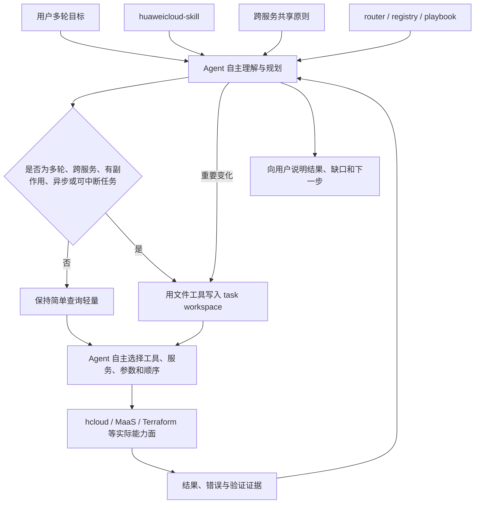

# 轻量大一统机制实施说明（v0.9.0）

本文以 `huaweicloud-skill` v0.9.0 首次实现为基线，说明当前 `main` 上的轻量大一统机制、运行边界和验证方法。它描述的是当前代码和资料，不是 plus 版的未来设计。

## 1. 需求与目标

### 1.1 要解决的问题

按服务拆分 Skill 有利于独立建设和按需加载，但一个真实用户目标经常同时涉及多个服务，并在多轮对话中不断追加或修改。例如：

> 帮我把企业网站部署到华为云，要求国内访问稳定、支持域名和 HTTPS，预算尽量低，后续还要有监控和日志。后来用户又补充：网站必须运行 Java 服务并连接数据库。

这个任务可能涉及计算、网络、数据库、DNS、证书、监控、日志和成本。Agent 可以根据现场选择 ECS、容器或其他组合，也可以在发现 region、权限或 API 限制后改变方案。Skill 不应预先锁死服务、参数和调用顺序，但需要帮助 Agent 在变化过程中保持：

- 当前目标和关键约束不丢失；
- 不同服务使用一致的事实、证据和完成语义；
- 用户修改目标后，旧方案不会继续被误用；
- 上下文缩短或任务中断后能够恢复；
- API 受理、资源就绪和业务完成不会被混为一谈。

### 1.2 反推目标

本版本不是先罗列已有功能，而是从未来希望验证的优势反推最小机制：

```text
跨服务和多轮任务更一致
  -> 共享少量长期稳定的原则和语义
  -> 复杂任务保留可恢复的 workspace 记忆
  -> 用多轮修改、中断恢复和简单查询场景验证
  -> 根据真实运行结果继续完善或简化
```

v0.9.0 的目标是验证机制可行性，不是宣称已经建成完整云任务治理平台。

## 2. 已实施内容

| 组件 | 文件 | 当前作用 |
| --- | --- | --- |
| 运行时入口 | `SKILL.md` | 声明 Skill 只提供辅助；复杂任务必须实际写入 Agent workspace，简单查询保持轻量。 |
| 跨服务共享原则 | `references/unified-principles.md` | 统一目标变化、信息来源、事实冲突、完成语义和证据表达。 |
| 任务工作区指南 | `references/task-workspace-guide.md` | 说明 task 隔离、最低记录内容、更新时点、恢复方式和写入失败处理。 |
| 轻量模板 | `templates/task.md`、`templates/progress.md` | 提供可删减、合并和扩展的起点，不要求固定 Schema。 |
| 目标—能力样例 | `references/goal-capability-guide.md` | 演示如何围绕企业网站目标组织跨服务候选、替代路径、缺口和验收。 |
| 契约测试 | `tests/test_unified_mechanism_contracts.py` | 防止任务记忆、自主性和渐进披露边界在后续修改中退化。 |
| 行为场景 | `tests/unified-mechanism-scenarios.md` | 定义多轮修改、上下文恢复、任务隔离、未知变化和简单查询的验证方法。 |

这些组件复用现有 router、registry、playbook、安全边界、输出策略和执行脚本，没有复制第二套服务/API 事实源，也没有改变 v0.8.2 的云操作门禁。

## 3. 运行架构



统一发生在共享信息、记录方法和结果表达层，不发生在 Agent 的具体执行路径。Agent 仍然可以：

- 选择或替换服务和工具；
- 调整参数、顺序、并行方式和重试方法；
- 遇到未知限制时寻找替代方案；
- 按任务复杂度删减、合并或扩展记录文件。

## 4. 两类共享信息

### 4.1 随 Skill 发布的全局共享知识

所有服务场景可以复用：

- 目标优先于初始方案；
- 区分用户声明、Agent 推断、工具观测和文档资料；
- 重要事实按需保留来源、观测时间和作用域；
- `planned`、`submitted`、`resource_ready`、`business_verified`、`partially_succeeded`、`outcome_unknown` 等词保持共同含义；
- 重要完成结论要有相应证据；
- 安全、授权、错误和大输出继续使用已有权威规则。

这些是长期稳定的方法和语义，不包含某个租户的实时资源状态。

### 4.2 Agent workspace 中按 task 隔离的工作记忆

任务实例属于 Agent 的运行时数据，不写入 Skill 源码目录。Agent 至少应能恢复：

- task ID 和当前目标；
- 当前仍有效的关键约束与用户授权边界；
- 期望结果和当前阶段；
- 最近重要进展、变化、失败或未知项；
- 当前方案、待决定事项、已知缺口和下一步；
- 重要 artifact 的用途和相对位置。

Skill 不要求创建 `TaskContract`、`TaskPlan` 等固定对象，也不要求每个字段单独存成文件。

## 5. workspace 与 task 隔离

### 5.1 运行时已经提供 task 级 workspace

如果 Agent 运行时已经为每个任务提供独立 workspace，并保证同一任务的多轮对话复用该目录，直接使用当前目录和运行时 task ID：

```text
<current-workspace>/
├── task.md
├── progress.md       # 可选
└── artifacts/        # 可选
```

不要再嵌套第二层 `tasks/<task_id>/`，也不要生成第二个 task ID。

### 5.2 多个 task 共用 workspace

如果多个任务共享同一个 workspace，使用稳定 task ID 隔离：

```text
tasks/<task_id>/
├── task.md
├── progress.md
└── artifacts/
```

自行生成的 task ID 不应包含秘密、手机号、账号、路径分隔符、`..` 或依赖进程 PID。

## 6. Agent 必须执行的最小动作

### 6.1 建立记录

预计多轮、跨服务、有副作用、异步或可能中断的任务，Agent 必须在首次实质规划或执行前，使用自身的文件读写工具把最小任务记忆实际写入 workspace。

只把计划保存在对话 context、运行时待办或平台自动日志中，不算完成了 Skill 要求的任务记录。

每轮收到新要求后都重新判断复杂度。任务最初是简单查询，但同一 task 后续升级为复杂任务时，要在下一项实质规划或执行前立即建立或更新任务入口；不能沿用初始判断，等真实资源已经改变后才补写状态文件。默认优先只创建 `task.md`，也可复用内容完整且容易发现的业务状态文件。

进入付费调用、真实云变更或异步等待前，Agent 再检查一次任务入口是否实际存在，目标、约束、授权边界和下一步是否仍然有效。这项检查不限制 Agent 调整方案、工具、参数和调用顺序。

### 6.2 更新记录

只在重要状态变化时更新：

| 变化 | 需要保留的内容 |
| --- | --- |
| 用户追加、修改或撤销要求 | 最新目标或约束，以及对旧方案的影响 |
| 获得关键结果或错误 | 摘要、来源、范围、缺口和后续影响 |
| 方案发生变化 | 当前方案、旧方案失效原因和待确认事项 |
| 准备结束本轮或可能中断 | 最近进展、未完成项和下一步 |
| 形成完成判断 | 完成、部分完成、未知或阻塞部分及依据 |

不要求保存每句对话、每次思考或每个普通工具调用。

重要变化要在当前轮写回。artifact 已经更新但任务入口仍保留旧待办，或者规格、方案和失败路径发生变化却不记录原因，都不满足可恢复任务记忆的预期。

### 6.3 恢复任务

恢复时先读取任务记忆入口和必要的最近进展，再判断哪些云侧实时事实已经过期、需要重新查询。新 task 不继承旧 task 的资源范围或执行授权。

轻量恢复检查只要求任务入口能够回答：这是哪个 task、当前目标是什么、哪些约束和授权仍有效、完成到什么阶段、发生过哪些重要变化或失败、证据在哪里以及下一步是什么。不能回答时补齐最小缺口，不为填满模板记录普通聊天或固定细粒度计划。

### 6.4 写入失败

workspace 不可写或文件工具失败时，Agent 要明确说明失败及影响，暂时保留最小上下文，并在条件恢复后补写；不能声称已经落盘，也不能把记录失败描述成云 API 失败。

### 6.5 可信摘要与 artifact

任务入口只保存 Agent 核验后的可信摘要、来源范围和 artifact 相对路径。未经处理的云 API、网页、工具输出和大输出保存在独立 artifact，不把原始内容反复带入任务记忆；这同时保留 v0.8.2 延续的大输出保护。

## 7. 为什么这些机制可能改善一致性

| 机制 | 直接作用 | 需要验证的结果 |
| --- | --- | --- |
| 共享目标与信息来源原则 | 不同服务采用相同的事实解释方法 | 减少范围混淆和无来源推断 |
| 每 task 的持久记忆 | 当前目标、约束和进展不只依赖模型 context | 多轮修改和中断恢复后仍能继续正确任务 |
| 共同完成语义 | 区分请求提交、资源就绪和业务验证 | 减少把局部 API 成功写成整体完成 |
| 目标—能力样例 | 先从用户目标看候选能力和缺口 | 减少按单服务视角遗漏跨服务依赖 |
| 重要变化更新规则 | 新要求能覆盖已经失效的旧方案 | 减少继续执行过时计划 |

这张表描述的是可检验的因果假设。只有行为测试和真实 Agent 运行持续提供证据后，才能把它们进一步量化为已证实优势。

## 8. 与 Agent 自主能力的边界

本机制面向能够读取 Skill、进行多轮对话，并具备 workspace 文件读写能力的常见 Agent。Skill 只规定复杂任务需要记住什么，不规定具体怎么完成任务。

当前明确不做：

- 不建设 Policy Engine 或统一 Execution Gateway；
- 不强制所有任务进入固定状态机；
- 不固定 API、参数、工具和调用顺序；
- 不要求所有 Agent 使用同一种文件格式；
- 不把 task 文件当作可信授权、审计账本或云侧实时状态库；
- 不限制 Agent 使用 Skill 之外的必要工具；
- 不声称纯 Skill 指令能够形成系统级不可绕过控制。

因此，这套机制可以辅助常见 Agent，但不能保证任何模型或运行时都一定遵守。运行时没有可写 workspace 时，仍可使用共享知识和原则，但不具备本版本的持久任务记忆能力。

## 9. 当前验证

### 9.1 自动契约测试

`tests/test_unified_mechanism_contracts.py` 检查：

- `SKILL.md` 是否保留复杂任务落盘和 Agent 自主性要求；
- workspace 指南是否同时支持 task 级和共享 workspace；
- 模板是否只定义最小语义，没有固定参数和不可变计划；
- 共享原则是否覆盖来源、时效、作用域、完成和证据；
- 目标—能力样例是否允许替代路径；
- 行为场景是否同时衡量收益、自主性和简单任务负担。

### 9.2 行为验证场景

`tests/unified-mechanism-scenarios.md` 以企业网站任务和简单 ECS 查询为基础，覆盖：

- 用户中途增加 Java 和数据库约束；
- 当前 region 的原服务/API 不可用；
- 清空上下文后从 workspace 恢复；
- 插入另一个简单查询后再回到原任务；
- 简单任务是否产生无价值记录负担。

### 9.3 本地 Agent 运行反馈

一次 CloudClaw 本地验证中，Agent 加载了当前 `huaweicloud-skill` 并使用运行时待办进行规划，但没有把复杂任务的最小记忆实际写入 workspace。该结果说明：运行时规划不自动等同于 Skill 要求的持久记录。

因此 v0.9.0 在 `SKILL.md` 中进一步强调：Agent 必须使用自身文件读写工具实际落盘，运行时待办和平台自动日志不能替代任务记录。

后续第二次 CloudClaw 运行揭示了更具体的生命周期缺口：

- 同一 task 起初只是 ECS 简单查询，Agent 不建立任务记录符合规则；
- 用户随后追加 ECS 建站和 MaaS 图片生成，任务已经升级，但 Agent 没有重新分类并及时建立记录；
- Agent 后续确实生成了业务状态、创建参数、安全组证据和 MaaS manifest，证明文件写入能力可用；
- 业务状态文件创建偏晚，且没有完整覆盖 task ID、目标、约束与授权、重要变化和 artifact 关系；
- MaaS 进展和规格变化发生后，状态文件没有及时更新。

这说明仅强调“必须写文件”还不够，关键是明确任务升级、更新和恢复的时点。当前 `main` 据此增加“升级时创建、变化时更新、恢复时读取”的精简生命周期、操作前轻量自检和可信摘要边界；仍需用相同场景复测实际遵循率。

## 10. 后续演进边界

plus 版可以在真实运行数据支持后继续研究更完整的共享对象、能力视图、证据索引、恢复体验和量化评测。v0.9.0 不提前实现这些内容，也不因为未来可能扩展而增加当前记录负担。

后续每项扩展都应先回答：

1. 是否至少被多个服务或场景复用；
2. Agent 是否真的会在后续决策中使用；
3. 不记录会造成什么具体错误；
4. 能否作为可选信息或合并进现有任务文件；
5. 对一致性的收益是否大于 token、文件和自主性成本。

## 11. 维护检查

修改该机制时，至少检查：

```bash
python3 -m unittest tests.test_unified_mechanism_contracts
git diff --check
```

发布前再运行项目全量单测、Ruff 和脚本编译检查。实现和本文冲突时，以 `SKILL.md`、`references/`、测试和实际代码为准，并同步修正文档。
